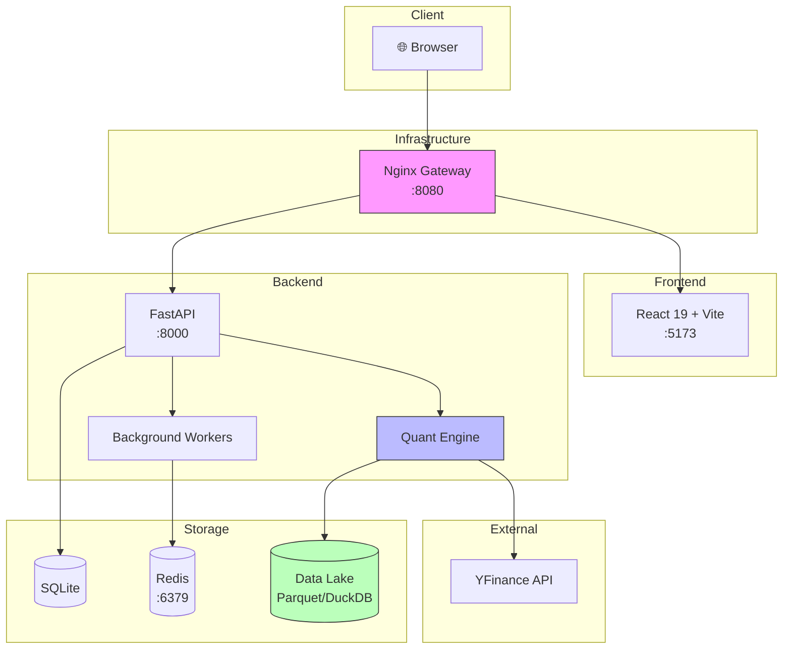

<p align="center">
  <h1 align="center">🚀 Alpha Quant</h1>
  <p align="center">
    <strong>Open-Source Institutional-Grade Quantitative Trading Platform</strong>
  </p>
  <p align="center">
    <a href="https://github.com/willychang21/DCA/actions"></a>
    <a href="https://github.com/willychang21/DCA/blob/main/LICENSE"></a>
    <a href="https://www.python.org/downloads/"></a>
    <a href="https://nodejs.org/"></a>
    <a href="https://fastapi.tiangolo.com/"></a>
    <a href="https://react.dev/"></a>
  </p>
  <p align="center">
    <a href="#-features">Features</a> •
    <a href="#-quick-start">Quick Start</a> •
    <a href="#-architecture">Architecture</a> •
    <a href="#-documentation">Docs</a> •
    <a href="#-contributing">Contributing</a>
  </p>
</p>

---

## 📌 Overview

**Alpha Quant** is a full-stack, open-source quantitative trading platform designed for systematic alpha generation, portfolio optimization, and risk management. It combines battle-tested quantitative finance algorithms with modern software engineering practices.

Whether you're a quant researcher prototyping strategies, a portfolio manager seeking institutional-quality tooling, or a developer learning algorithmic trading — Alpha Quant provides a production-ready foundation.

### Why Alpha Quant?

| Challenge | Our Solution |
|-----------|--------------|
| Factor research is fragmented | **10+ pre-built factors** with plugin architecture for easy extension |
| Portfolio optimization is complex | **4 optimizers** (HRP, Black-Litterman, Kelly, MVO) with YAML configuration |
| Regime changes break strategies | **HMM regime detection** with dynamic factor weighting |
| Backtesting leaks information | **Walk-forward CV** with purging and embargo periods |
| ML models lack interpretability | **SHAP attribution** and constrained GBM for economic intuition |

---

## ✨ Features

### 🧮 Alpha Generation

- **12+ Academic Alpha Factors**
  - Value: VSM (Value-Size-Momentum), BAB (Betting Against Beta), QMJ (Quality Minus Junk)
  - Momentum: PEAD (Post-Earnings Announcement Drift), Advanced Rotation
  - Alternative: Sentiment, Capital Flow, Accruals, IVOL, Analyst Revisions
- **HMM Regime Detection** — 2-state Gaussian HMM classifying Bull/Bear markets
- **Online Regime Detector** — Adaptive detection with exponential decay and drift monitoring
- **Triple Barrier Labeling** — Path-dependent target generation for ML training

### 📊 Portfolio Construction

- **Multiple Optimizers**: Mean-Variance (MVO), Hierarchical Risk Parity (HRP), Black-Litterman, Multivariate Kelly
- **Risk Controls**: Volatility targeting, sector caps, max position limits, beta constraints
- **Execution Simulation**: VWAP scheduling with market impact estimation

### 📈 Analytics Dashboard

- **Real-time P&L Tracking** — Portfolio performance with position-level attribution
- **Backtest Lab** — Walk-forward cross-validation, Monte Carlo simulations, factor attribution
- **Risk Monitor** — Component VaR decomposition, correlation heatmaps, drawdown analysis

### 🧠 ML Alpha Enhancement

- **SHAP Attribution** — Factor importance via Shapley values with concentration monitoring
- **Constrained GBM** — LightGBM with monotonic constraints preserving economic intuition
- **Residual Alpha Model** — Two-stage decomposition (Linear/NAM + GBM residuals)
- **XGBoost Meta-Labeling** — Confidence scoring for primary signals

### 🔌 Plugin Architecture

- **Registry Pattern** — Extensible factors, optimizers, and risk models as plugins
- **Config-Driven Pipelines** — YAML-based strategy configuration
- **11 Built-in Plugins** — 4 factors, 4 optimizers, 3 risk constraints ready to use

### 🔬 Valuation Models

- **DCF** — Discounted Cash Flow with WACC estimation
- **DDM** — Dividend Discount Model with multi-stage growth
- **RIM** — Residual Income Model for factor scoring
- **REIT** — Specialized FFO-based valuation

### 🛡️ Production Infrastructure

- **Circuit Breaker Pattern** — Resilient external API calls with automatic recovery
- **Data Freshness Alerts** — Monitoring for stale data conditions
- **Alembic Migrations** — Version-controlled database schema management
- **Health Endpoints** — Deep health checks for monitoring and alerting
- **Security Scanning** — pip-audit, bandit, npm audit, gitleaks in CI pipeline

---

## 🚀 Quick Start

### Prerequisites

| Tool | Version |
|------|---------|
| Python | 3.10+ |
| Node.js | 18+ |
| Docker | (Optional) |

### Option 1: One-Command Launch (Recommended)

```bash
# Clone the repository
git clone https://github.com/willychang21/DCA.git
cd DCA

# Launch both backend and frontend
./launch_backend.sh &
./launch_frontend.sh
```

### Option 2: Manual Setup

**Backend:**

```bash
cd backend
python -m venv .venv
source .venv/bin/activate  # Windows: .venv\Scripts\activate
pip install -r requirements.txt
cp .env.example .env       # Configure as needed
python main.py             # Starts on http://localhost:8000
```

**Frontend:**

```bash
cd frontend
npm install
npm run dev                # Starts on http://localhost:5173
```

### Option 3: Docker Compose

```bash
docker-compose up -d

# Access points:
# - API Gateway: http://localhost:8080
# - Frontend: http://localhost:5173
```

### Verify Installation

```bash
# Health check
curl http://localhost:8000/api/v1/health

# Get latest rankings
curl http://localhost:8000/api/v1/quant/rankings?limit=10
```

---

## 🏗️ Architecture



### Tech Stack

| Layer | Technologies |
|-------|--------------|
| **Frontend** | React 19, TypeScript, Vite, TailwindCSS, Recharts, Framer Motion |
| **Backend** | Python 3.10+, FastAPI, Pydantic, SQLAlchemy, DuckDB |
| **Quant Core** | NumPy, Pandas, SciPy, CVXPY, XGBoost, LightGBM, SHAP |
| **Infrastructure** | Docker, SQLite (default), Redis, Nginx, Ray |
| **MLOps** | MLflow, Parquet, Alembic |

---

## 📚 Documentation

| Document | Description |
|----------|-------------|
| [Frontend README](./frontend/README.md) | Dashboard architecture & components |
| [Backend README](./backend/README.md) | Complete quant engine documentation |
| [Technical Manual](./backend/docs/TECHNICAL_MANUAL.md) | Deep dive: algorithms, formulas, architecture |

## 🧪 Development

### Running Tests

```bash
# Backend tests
cd backend
pytest tests/ -v

# With coverage
pytest tests/ --cov=quant --cov=app --cov-report=html

# Property-based tests only
pytest tests/ -v -m "property"

# Frontend tests
cd frontend
npm run test
```

### Code Quality

```bash
# Linting (Backend)
ruff check .
ruff format .

# Type checking (Backend)
mypy app quant

# Frontend linting
npm run lint
```

### Adding a New Factor

1. Create a new file in `backend/quant/plugins/factors/`:

```python
# backend/quant/plugins/factors/my_factor.py
from quant.core import FactorBase, PluginMetadata, register_factor

@register_factor("MyFactor")
class MyFactor(FactorBase):
    @property
    def metadata(self) -> PluginMetadata:
        return PluginMetadata(
            name="MyFactor",
            description="My custom alpha factor",
            version="1.0.0"
        )
    
    def compute(self, data: pd.DataFrame) -> pd.Series:
        return data.groupby("ticker")["close"].pct_change(20)
```

2. Add to your strategy config:

```yaml
# config/strategies.yaml
factors:
  - name: "VSM"
  - name: "MyFactor"
    params: {lookback: 20}
```

### CI/CD Pipeline

The GitHub Actions workflow (`.github/workflows/quant_ci.yml`) includes:

- ✅ Backend unit and property tests
- ✅ Frontend linting and type checking
- ✅ Security scanning (pip-audit, bandit, npm audit, gitleaks)
- ✅ Script validation (dry run)