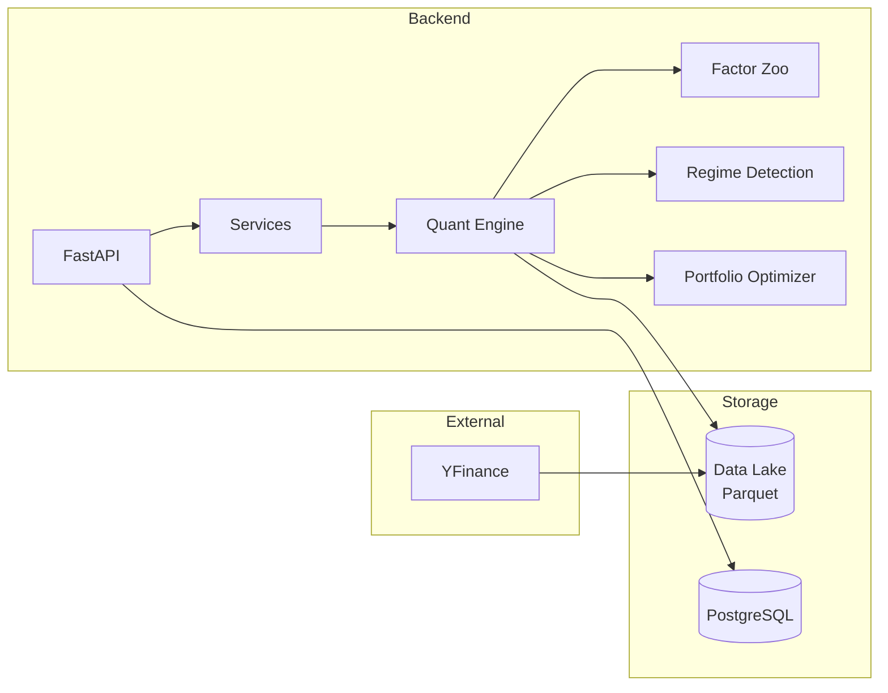

# DCA Quant Backend

> **Institutional-Grade Alpha Engine for Systematic Trading**

A production-ready quantitative trading platform featuring multi-factor alpha generation, regime-aware portfolio optimization, and ML-enhanced signal processing. Built with Python, FastAPI, and modern MLOps practices.

[](https://www.python.org/downloads/)
[](https://fastapi.tiangolo.com/)
[](../LICENSE)

---

## ✨ Key Features

- **10+ Alpha Factors** — VSM, BAB, QMJ, PEAD, Sentiment, Capital Flow, Rotation
- **Registry Pattern** — Plugin-based architecture for factors, optimizers, and risk models
- **Regime Detection** — HMM-based Bull/Bear classification with dynamic factor weighting
- **ML Enhancement** — SHAP attribution, Constrained GBM, Residual Alpha modeling
- **Portfolio Optimization** — HRP, Black-Litterman, Multivariate Kelly (all loadable via Registry)
- **Risk Management** — Component VaR decomposition, tail hedging, constraint plugins
- **Distributed Backtesting** — Ray-powered parallel Walk-Forward CV
- **Operational Resilience** — Circuit breaker, data freshness alerts, health endpoints

---

## 🏗️ System Overview



> 📖 **Deep Dive:** See [docs/TECHNICAL_MANUAL.md](docs/TECHNICAL_MANUAL.md) for detailed architecture diagrams, mathematical formulas, and component internals.

---

## 🚀 Quick Start

### Prerequisites

| Requirement | Version |
|-------------|---------|
| Python | 3.10+ |
| pip | Latest |
| Git | Any |

### 1. Clone & Install

```bash
git clone https://github.com/your-org/DCA.git
cd DCA/backend

# Create virtual environment
python -m venv .venv
source .venv/bin/activate  # Windows: .venv\Scripts\activate

# Install dependencies
pip install -r requirements.txt
```

### 2. Configure Environment

```bash
# Copy example config
cp .env.example .env

# Edit with your settings (optional)
nano .env
```

**Key `.env` variables:**

```env
# Database
DATABASE_URL=sqlite:///./data/quant.db

# Data paths
DATA_LAKE_PATH=./data_lake

# Server
UVICORN_HOST=0.0.0.0
UVICORN_PORT=8000

# Optional: API keys
YFINANCE_RATE_LIMIT=5
```

### 3. Run the Server

```bash
# Start the API server (auto-applies DB migrations)
python main.py

# Or with uvicorn directly
uvicorn main:app --reload --host 0.0.0.0 --port 8000
```

**Server is ready when you see:**
```
INFO:     Application startup complete.
INFO:     Uvicorn running on http://0.0.0.0:8000
```

### 4. Run Daily Jobs

```bash
# Update data & generate rankings
python scripts/run_daily_job.py

# Weekly genetic optimization (Sundays)
python scripts/run_weekly_job.py
```

### 5. Verify Installation

```bash
# Health check
curl http://localhost:8000/api/v1/health

# Get latest rankings
curl http://localhost:8000/api/v1/quant/rankings?limit=10
```

---

## 📁 Project Structure

```
backend/
├── main.py                 # FastAPI entry point
├── config/                 # Pydantic Settings
│   └── strategies.yaml     # Strategy configuration (YAML)
│
├── app/                    # 🌐 API Layer
│   ├── api/v1/endpoints/   # REST endpoints
│   └── services/           # Business logic
│
├── quant/                  # 📊 Quant Core Engine
│   ├── core/               # 🔌 Registry Pattern (NEW)
│   │   ├── interfaces.py   # FactorBase, OptimizerBase, RiskModelBase
│   │   ├── registry.py     # PluginRegistry singleton
│   │   ├── config_models.py# Pydantic config schemas
│   │   └── config_loader.py# YAML/JSON loader
│   │
│   ├── plugins/            # 🧩 Plugin Directory (NEW)
│   │   ├── factors/        # Factor plugins (VSM, BAB, QMJ, Momentum)
│   │   ├── optimizers/     # Optimizer plugins (HRP, MVO, BL, Kelly)
│   │   └── risk_models/    # Risk plugins (MaxWeight, Sector, Beta)
│   │
│   ├── features/           # Factor pipeline & dynamic loading
│   ├── regime/             # HMM regime detection
│   ├── portfolio/          # Portfolio optimizer (uses Registry)
│   ├── backtest/           # Distributed backtesting (Ray)
│   └── data/               # Data providers & validation
│
├── compute/                # ⚡ Async Job Processing
│   ├── broker.py           # Message queue
│   └── worker.py           # Background workers
│
├── scripts/                # 🔧 Operational Scripts
│   ├── run_daily_job.py    # Daily rankings
│   └── run_weekly_job.py   # Weekly optimization
│
└── data_lake/              # 💾 Parquet Storage
    ├── raw/                # Ingested OHLCV data
    └── processed/          # Computed signals
```

---

## 📚 Documentation

| Document | Description |
|----------|-------------|
| [**TECHNICAL_MANUAL.md**](docs/TECHNICAL_MANUAL.md) | Deep dive: architecture, math, algorithms |
| [**API Reference**](docs/TECHNICAL_MANUAL.md#api-reference) | REST endpoints & schemas |
| [**Factor Formulas**](docs/TECHNICAL_MANUAL.md#factor-formula-reference) | Mathematical definitions |
| [**Design Decisions**](docs/TECHNICAL_MANUAL.md#design-decisions--trade-offs) | Why HRP? Why DuckDB? |

---

## 🔌 Plugin Architecture

All factors, optimizers, and risk models use the **Registry Pattern** for extensibility.

### Adding a New Factor

```python
# quant/plugins/factors/my_factor.py
from quant.core import FactorBase, PluginMetadata, register_factor

@register_factor("MyFactor")
class MyFactor(FactorBase):
    @property
    def metadata(self):
        return PluginMetadata(name="MyFactor", description="My custom factor")
    
    def compute(self, data):
        return data.groupby("ticker")["close"].pct_change()
```

### Using Config-Driven Pipeline

```yaml
# config/strategies.yaml
factors:
  - name: "VSM"
  - name: "MyFactor"
    params: {lookback: 60}
optimizer:
  name: "HRP"
risk_rules:
  - name: "MaxWeight"
    params: {max_weight: 0.10}
```

```python
from quant.features.pipeline import FactorPipeline
pipeline = FactorPipeline.from_config("config/strategies.yaml")
results = pipeline.compute_all(market_data)
```

---

## 🧪 Testing

```bash
# Run all tests
pytest tests/ -v

# Run with coverage
pytest tests/ --cov=quant --cov=app --cov-report=html

# Run property-based tests only
pytest tests/ -v -m "property"
```

---

## 🤝 Contributing

1. Fork the repository
2. Create a feature branch (`git checkout -b feature/my-feature`)
3. Write tests for new functionality
4. Ensure all tests pass (`pytest tests/ -v`)
5. Submit a pull request

---

## 📄 License

MIT License. See [LICENSE](../LICENSE) for details.

---

*Built with ❤️ for systematic traders*
