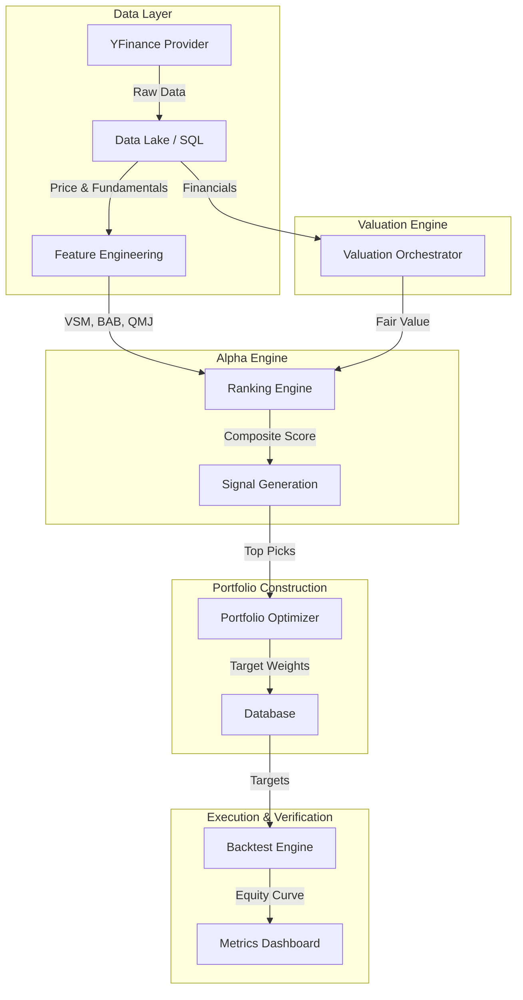

# DCA Quant Backend

The **DCA Quant Backend** is a sophisticated, event-driven quantitative trading engine designed to replicate hedge-fund grade workflows. It handles the entire lifecycle of algorithmic trading: from data ingestion and intrinsic valuation to multi-factor ranking, portfolio optimization, and realistic backtesting.

---

## 1. System Architecture

The system operates on a modular, layered architecture designed for scalability and separation of concerns.



### Core Components

*   **Data Layer (`quant.data`)**: Manages the schema (SQLAlchemy) and data ingestion. It abstracts the data source (YFinance) behind a provider interface, allowing for future swappability (e.g., Bloomberg, Polygon).
*   **Valuation Engine (`quant.valuation`)**: A fundamental analysis engine that determines the "intrinsic value" of assets using models like DCF and DDM.
*   **Alpha Engine (`quant.features`, `quant.selection`)**: Generates predictive signals based on academic factors (Momentum, Quality, Low Beta).
*   **Portfolio Optimizer (`quant.portfolio`)**: Uses convex optimization (CVXPY) to construct efficient portfolios that maximize expected return for a given risk level.
*   **Backtest Engine (`quant.backtest`)**: A realistic simulator that accounts for transaction costs, slippage, and market impact.

---

## 2. Directory Structure

The codebase is organized to reflect the quantitative workflow.

```
backend/
├── app/                        # FastAPI Application Layer
│   ├── api/                    # REST API Endpoints
│   ├── core/                   # Configuration, Database, Logging
│   └── services/               # Application Services
├── quant/                      # Quantitative Core (The "Brain")
│   ├── backtest/               # Simulation Engine
│   │   ├── engine.py           # Event-Driven Backtester
│   │   └── walk_forward.py     # Walk-Forward Analysis
│   ├── data/                   # Data Access Layer
│   │   ├── models.py           # SQLAlchemy ORM Models
│   │   └── dao.py              # Data Access Objects
│   ├── features/               # Alpha Factor Library
│   │   ├── volatility.py       # Volatility-Scaled Momentum (VSM)
│   │   ├── beta.py             # Betting-Against-Beta (BAB)
│   │   └── quality.py          # Quality-Minus-Junk (QMJ)
│   ├── portfolio/              # Portfolio Construction
│   │   └── optimizer.py        # Mean-Variance Optimizer (MVO)
│   ├── selection/              # Signal Generation
│   │   └── ranking.py          # Composite Ranking Logic
│   └── valuation/              # Intrinsic Valuation
│       ├── orchestrator.py     # Model Selection Logic
│       └── models/             # DCF, DDM, REIT Models
├── scripts/                    # Operational Workflows
│   ├── run_daily_job.py        # End-to-End Pipeline Entrypoint
│   └── seed_securities.py      # Universe Management
└── tests/                      # Test Suite (Pytest)
```

---

## 3. Detailed Workflows

### 3.1 Daily Signal Generation Pipeline
The `run_daily_job.py` script is the heartbeat of the system. It executes the following steps:

1.  **Universe Selection**: Loads active securities (S&P 500 + Nasdaq 100) from the database.
2.  **Data Ingestion**:
    *   Fetches 2 years of OHLCV data and latest financial statements via `YFinanceProvider`.
    *   Handles rate limits and missing data gracefully.
3.  **Factor Computation**:
    *   **VSM**: 12-month return / 1-year realized volatility.
    *   **BAB**: Leveraged low-beta vs. high-beta (Frazzini & Pedersen, 2014).
    *   **QMJ**: Composite of Profitability, Growth, Safety, and Payout (Asness et al., 2013).
    *   **Upside**: `(Fair Value - Price) / Price` from the Valuation Engine.
4.  **Ranking & Scoring**:
    *   Normalizes raw factors into Z-Scores.
    *   Neutralizes scores by sector (Sector-Neutral Ranking).
    *   Computes a weighted composite score: `30% VSM + 20% BAB + 30% QMJ + 20% Upside`.
5.  **Portfolio Optimization**:
    *   Selects the top 50 ranked assets.
    *   Runs Mean-Variance Optimization (MVO) to find optimal weights.
    *   Constraints: Long-only (`w >= 0`), Max weight 10% (`w <= 0.10`), Fully invested (`sum(w) == 1`).

### 3.2 Valuation Logic
The `ValuationOrchestrator` dynamically selects the appropriate model for each asset:

| Sector | Model | Logic |
| :--- | :--- | :--- |
| **Financial Services** | **DDM** | Dividend Discount Model or Excess Return Model. Banks are valued on equity/dividends. |
| **Real Estate** | **REIT Model** | Focuses on FFO (Funds From Operations) and NAV. |
| **Technology / General** | **DCF** | Discounted Cash Flow. Projects FCFF for 5-10 years + Terminal Value (Gordon Growth). |

---

## 4. Operational Guide

### Adding a New Ticker
To add a new stock to the tracked universe:
```bash
# Add to seed_securities.py list or run SQL
sqlite3 data/database.sqlite "INSERT INTO securities (ticker, name, active) VALUES ('NVDA', 'NVIDIA Corp', 1);"
```

### Running Backtests
To verify strategy performance over a historical period:
```python
from quant.backtest.walk_forward import WalkForwardBacktester
from app.core.database import get_db

db = next(get_db())
backtester = WalkForwardBacktester(db)
results = backtester.run(start_date=date(2023, 1, 1), end_date=date(2024, 1, 1))
print(results['metrics']) # Sharpe, CAGR, MaxDD
```

### Troubleshooting "N/A" Signals
If the dashboard shows "N/A" or "0.0":
1.  **Check Logs**: Look for `YFinance rate limit` or `Missing financial statements`.
2.  **Verify Data**: Use `sqlite3` to check if `model_signals` has valid `metadata_json`.
3.  **Run Debug Script**: Use `scripts/debug_valuation_details.py` to inspect specific tickers.

---

## 5. Development Setup

### Prerequisites
*   **Python 3.10+**
*   **SQLite** (Included)

### Installation
```bash
python -m venv venv
source venv/bin/activate
pip install -r requirements.txt
```

### Running the Server
```bash
fastapi dev main.py
```

### Running Tests
```bash
pytest tests/
```

---

## 6. API Reference

The backend exposes a REST API via FastAPI.

*   `GET /api/v1/quant/signals`: Get latest ranking signals.
*   `GET /api/v1/quant/valuation/{ticker}`: Get detailed valuation model output.
*   `GET /api/v1/quant/backtest/run`: Trigger an on-demand backtest.

See `http://localhost:8000/docs` for the interactive Swagger UI.
