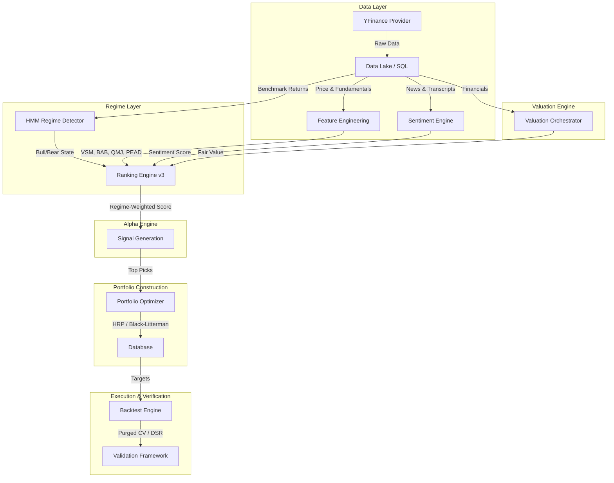

# DCA Quant Backend (Tier-1 Hedge Fund Grade)

The **DCA Quant Backend** is a sophisticated, event-driven quantitative trading engine designed to replicate hedge-fund grade workflows. It handles the entire lifecycle of algorithmic trading: from data ingestion and intrinsic valuation to multi-factor ranking, regime detection, portfolio optimization, and robust backtesting.

---

## 1. System Architecture

The system operates on a modular, layered architecture designed for scalability and separation of concerns.



### Core Components

*   **Data Layer (`quant.data`)**: Manages the schema (SQLAlchemy) and data ingestion. Abstracts data sources (YFinance) and handles caching.
*   **Regime Layer (`quant.regime`)**: Uses Hidden Markov Models (HMM) to detect market regimes (Bull/Bear) and adjust factor weights dynamically.
*   **Alpha Engine (`quant.features`, `quant.selection`)**: Generates predictive signals based on:
    *   **Risk Factors**: Volatility-Scaled Momentum (VSM), Betting-Against-Beta (BAB), Idiosyncratic Volatility (IVOL).
    *   **Quality Factors**: Quality-Minus-Junk (QMJ), Accruals Anomaly.
    *   **Behavioral Factors**: Post-Earnings Announcement Drift (PEAD), NLP Sentiment (FinBERT).
*   **Valuation Engine (`quant.valuation`)**: Determines "intrinsic value" using DCF, DDM, and REIT models.
*   **Portfolio Optimizer (`quant.portfolio`)**: Constructs efficient portfolios using Hierarchical Risk Parity (HRP) or Black-Litterman models.
*   **Validation Framework (`quant.backtest.validation`)**: Ensures strategy robustness using Purged Walk-Forward Cross-Validation and Deflated Sharpe Ratio (DSR).

---

## 2. Directory Structure

The codebase is organized to reflect the quantitative workflow.

```
backend/
├── app/                        # FastAPI Application Layer
│   ├── api/                    # REST API Endpoints
│   ├── core/                   # Configuration, Database, Logging
│   └── services/               # Application Services
├── quant/                      # Quantitative Core (The "Brain")
│   ├── backtest/               # Simulation & Validation
│   │   ├── engine.py           # Event-Driven Backtester
│   │   ├── validation.py       # Purged Walk-Forward CV
│   │   └── statistics.py       # Deflated Sharpe Ratio
│   ├── data/                   # Data Access Layer
│   ├── features/               # Alpha Factor Library
│   │   ├── pead.py             # Post-Earnings Announcement Drift
│   │   ├── sentiment.py        # NLP Sentiment Analysis
│   │   ├── volatility.py       # VSM, IVOL
│   │   ├── beta.py             # BAB
│   │   └── quality.py          # QMJ, Accruals
│   ├── portfolio/              # Portfolio Construction
│   │   ├── optimizer.py        # Optimization Orchestrator
│   │   └── advanced_optimizers.py # HRP, Black-Litterman
│   ├── regime/                 # Market Regime Detection
│   │   └── hmm.py              # Hidden Markov Model
│   ├── selection/              # Signal Generation
│   │   └── ranking.py          # RankingEngine v3 (Dynamic Weights)
│   └── valuation/              # Intrinsic Valuation
│       ├── orchestrator.py     # Model Selection Logic
│       └── models/             # DCF, DDM, REIT Models
├── scripts/                    # Operational Workflows
│   ├── run_daily_job.py        # End-to-End Pipeline Entrypoint
│   └── verify_ranking_v3.py    # Verification Script
└── tests/                      # Test Suite (Pytest)
```

---

## 3. Detailed Workflows

### 3.1 Daily Signal Generation Pipeline (RankingEngine v3)
The `run_daily_job.py` script executes the following steps:

1.  **Universe Selection**: Loads active securities (S&P 500 + Nasdaq 100).
2.  **Regime Detection**:
    *   Fits Gaussian HMM to SPY returns.
    *   Predicts current state: **Bull** (Low Vol) or **Bear** (High Vol).
3.  **Factor Computation**:
    *   **VSM/BAB/QMJ**: Core risk and quality factors.
    *   **PEAD**: Earnings surprise and momentum.
    *   **Sentiment**: News/Earnings call sentiment via NLP.
    *   **Upside**: Valuation gap from DCF/DDM models.
4.  **Dynamic Scoring**:
    *   Weights are adjusted based on Regime:
        *   **Bull**: Overweight Momentum (VSM) and Growth.
        *   **Bear**: Overweight Quality (QMJ) and Low Beta (BAB).
5.  **Portfolio Optimization**:
    *   **HRP**: Clusters assets by correlation to minimize portfolio variance without matrix inversion issues.
    *   **Black-Litterman**: Blends market equilibrium with our Alpha views.

### 3.2 Valuation Logic
The `ValuationOrchestrator` dynamically selects the appropriate model:

| Sector | Model | Logic |
| :--- | :--- | :--- |
| **Financial Services** | **DDM** | Dividend Discount Model. |
| **Real Estate** | **REIT Model** | FFO (Funds From Operations) and NAV. |
| **Technology / General** | **DCF** | Discounted Cash Flow (5-10yr FCFF + Terminal). |

---

## 4. Operational Guide

### Adding a New Ticker
```bash
sqlite3 data/database.sqlite "INSERT INTO securities (ticker, name, active) VALUES ('NVDA', 'NVIDIA Corp', 1);"
```

### Running the Daily Job
```bash
python -m scripts.run_daily_job
```

### Verifying Signals
```bash
python -m scripts.verify_ranking_v3
```

### Running Validation Tests
To verify strategy robustness (DSR, PurgedCV):
```bash
pytest tests/test_validation_framework.py
```

---

## 5. Development Setup

### Prerequisites
*   **Python 3.10+**
*   **SQLite**

### Installation
```bash
python -m venv venv
source venv/bin/activate
pip install -r requirements.txt
```

### Running the Server
```bash
fastapi dev main.py
```

### API Reference
*   `GET /api/v1/quant/rankings`: Get latest v3 ranking signals.
*   `GET /api/v1/quant/signals`: Get historical signals with metadata.

See `http://localhost:8000/docs` for Swagger UI.
