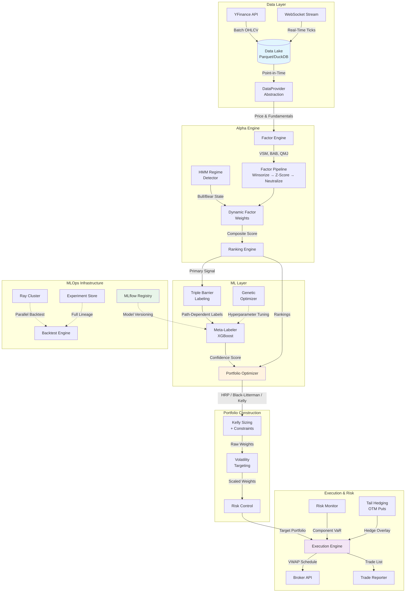

# DCA Quant Backend

> **Enterprise-Grade Quantitative Trading Engine**

A production-ready, institutional-grade quantitative trading platform implementing state-of-the-art alpha generation, portfolio optimization, and risk management. Built with Python, FastAPI, and modern MLOps practices.

---

## Table of Contents

- [DCA Quant Backend](#dca-quant-backend)
  - [Table of Contents](#table-of-contents)
  - [1. Executive Summary](#1-executive-summary)
    - [1.1 Overview](#11-overview)
    - [1.2 Key Capabilities](#12-key-capabilities)
    - [1.3 Technology Stack](#13-technology-stack)
  - [2. System Architecture](#2-system-architecture)
    - [2.1 High-Level Architecture](#21-high-level-architecture)
    - [2.2 Data Flow Pipeline](#22-data-flow-pipeline)
    - [2.3 Component Interaction Matrix](#23-component-interaction-matrix)
  - [3. Directory Structure](#3-directory-structure)
  - [4. Core Components](#4-core-components)
    - [4.1 Data Layer](#41-data-layer)
      - [4.1.1 DataProvider Abstraction](#411-dataprovider-abstraction)
      - [4.1.2 Point-in-Time (PIT) Data Access](#412-point-in-time-pit-data-access)
      - [4.1.3 Signal Store](#413-signal-store)
    - [4.2 Alpha Engine](#42-alpha-engine)
      - [4.2.1 Factor Zoo](#421-factor-zoo)
      - [4.2.2 Factor Implementation Example: VSM](#422-factor-implementation-example-vsm)
      - [4.2.3 Factor Pipeline](#423-factor-pipeline)
      - [4.2.4 HMM Regime Detection](#424-hmm-regime-detection)
      - [4.2.5 Dynamic Factor Weighting](#425-dynamic-factor-weighting)
    - [4.3 Machine Learning Layer](#43-machine-learning-layer)
      - [4.3.1 Triple Barrier Labeling](#431-triple-barrier-labeling)
      - [4.3.2 Meta-Labeling (XGBoost)](#432-meta-labeling-xgboost)
      - [4.3.3 Genetic Hyperparameter Optimization](#433-genetic-hyperparameter-optimization)
    - [4.4 Portfolio Construction](#44-portfolio-construction)
      - [4.4.1 Optimizer Selection](#441-optimizer-selection)
      - [4.4.2 Hierarchical Risk Parity (HRP)](#442-hierarchical-risk-parity-hrp)
      - [4.4.3 Multivariate Kelly Criterion](#443-multivariate-kelly-criterion)
      - [4.4.4 Volatility Targeting](#444-volatility-targeting)
    - [4.5 Execution \& Risk](#45-execution--risk)
      - [4.5.1 VWAP Execution Algorithm](#451-vwap-execution-algorithm)
      - [4.5.2 Component VaR Decomposition](#452-component-var-decomposition)
      - [4.5.3 Tail Hedging](#453-tail-hedging)
    - [4.6 Infrastructure](#46-infrastructure)
      - [4.6.1 Distributed Backtesting (Ray)](#461-distributed-backtesting-ray)
      - [4.6.2 Purged Walk-Forward Cross-Validation](#462-purged-walk-forward-cross-validation)
      - [4.6.3 Statistical Validation](#463-statistical-validation)
      - [4.6.4 MLflow Model Registry](#464-mlflow-model-registry)
      - [4.6.5 Experiment Store](#465-experiment-store)
      - [4.6.6 Circuit Breaker Pattern](#466-circuit-breaker-pattern-phase-3)
      - [4.6.7 Data Freshness Service](#467-data-freshness-service-phase-3)
      - [4.6.8 Database Migrations (Alembic)](#468-database-migrations-alembic)
      - [4.6.9 Centralized Configuration](#469-centralized-configuration-pydantic-settings)
      - [4.6.10 Health Endpoints](#4610-health-endpoints-phase-3)
  - [5. API Reference](#5-api-reference)
    - [5.1 REST Endpoints](#51-rest-endpoints)
      - [Base URL: `/api/v1`](#base-url-apiv1)
    - [5.2 Endpoint Details](#52-endpoint-details)
      - [GET `/health`](#get-health)
      - [GET `/quant/rankings`](#get-quantrankings)
      - [GET `/quant/risk/metrics`](#get-quantriskmetrics)
      - [GET `/quant/dashboard/summary`](#get-quantdashboardsummary)
  - [6. Data Models \& Schemas](#6-data-models--schemas)
    - [6.1 SQLAlchemy ORM Models](#61-sqlalchemy-orm-models)
    - [6.2 Parquet Schemas](#62-parquet-schemas)
      - [Signals Schema](#signals-schema)
      - [Targets Schema](#targets-schema)
  - [7. Operational Guide](#7-operational-guide)
    - [7.1 Daily Operations](#71-daily-operations)
      - [7.1.1 Daily Update Workflow](#711-daily-update-workflow)
      - [7.1.2 Ranking Job Flow](#712-ranking-job-flow)
    - [7.2 Weekly Operations](#72-weekly-operations)
      - [7.2.1 Genetic Optimization](#721-genetic-optimization)
    - [7.3 Monitoring \& Alerting](#73-monitoring--alerting)
      - [7.3.1 Logging Configuration](#731-logging-configuration)
      - [7.3.2 Key Metrics to Monitor](#732-key-metrics-to-monitor)
      - [7.3.3 Health Endpoints](#733-health-endpoints)
      - [7.3.4 Data Freshness Alerting](#734-data-freshness-alerting)
  - [8. Development Setup](#8-development-setup)
    - [8.1 Prerequisites](#81-prerequisites)
    - [8.2 Installation](#82-installation)
    - [8.3 Environment Configuration](#83-environment-configuration)
    - [8.4 Running the Server](#84-running-the-server)
  - [9. Testing Strategy](#9-testing-strategy)
    - [9.1 Test Categories](#91-test-categories)
    - [9.2 Running Tests](#92-running-tests)
    - [9.3 Key Test Cases](#93-key-test-cases)
  - [10. Performance Considerations](#10-performance-considerations)
    - [10.1 DuckDB Query Optimization](#101-duckdb-query-optimization)
    - [10.2 Price Cache Strategy](#102-price-cache-strategy)
    - [10.3 Ray Parallelization Patterns](#103-ray-parallelization-patterns)
    - [10.4 Memory Management](#104-memory-management)
  - [11. Design Decisions \& Trade-offs](#11-design-decisions--trade-offs)
    - [11.1 Parquet over SQLite for Signals](#111-parquet-over-sqlite-for-signals)
    - [11.2 HRP as Default Optimizer](#112-hrp-as-default-optimizer)
    - [11.3 Half-Kelly Fractional Sizing](#113-half-kelly-fractional-sizing)
    - [11.4 Embargo Period Calculation](#114-embargo-period-calculation)
  - [12. References](#12-references)
    - [Academic Papers](#academic-papers)
    - [Factor Research](#factor-research)
    - [Implementation Guides](#implementation-guides)
  - [License](#license)
  - [Contributing](#contributing)

---

## 1. Executive Summary

### 1.1 Overview

The DCA Quant Backend is a **three-tier quantitative trading engine** designed for systematic equity selection, portfolio construction, and risk-aware execution. The system has evolved through three maturity tiers:

| Tier | Focus | Key Capabilities |
|------|-------|------------------|
| **Tier-1** | Alpha Generation | Multi-factor model, HMM regime detection, sector neutralization |
| **Tier-2** | Portfolio Construction | Kelly criterion, volatility targeting, Black-Litterman |
| **Tier-3** | Production Infrastructure | Ray distributed computing, MLflow tracking, real-time streaming |
| **Phase-3** | Operational Resilience | Health endpoints, circuit breaker, data freshness, Alembic migrations |

### 1.2 Key Capabilities

- **Alpha Generation**: 8+ academically-validated factors (VSM, BAB, QMJ, PEAD, Sentiment)
- **Regime Awareness**: Hidden Markov Model for Bull/Bear classification with dynamic factor weighting
- **Portfolio Optimization**: HRP, Black-Litterman, and Multivariate Kelly with sector/beta constraints
- **Risk Management**: Component VaR decomposition, tail hedging via OTM puts
- **Execution**: VWAP scheduling with market impact estimation
- **MLOps**: Full experiment lineage with MLflow and reproducible backtests
- **Operational Resilience**: Circuit breaker pattern, data freshness alerting, health endpoints
- **Database Management**: Alembic migrations with auto-apply on startup

### 1.3 Technology Stack

| Layer | Technologies |
|-------|--------------|
| **API** | FastAPI, Pydantic, Uvicorn |
| **Data** | DuckDB, Parquet, SQLAlchemy, YFinance |
| **Computation** | NumPy, Pandas, SciPy, CVXPY |
| **ML** | XGBoost, Scikit-learn, SHAP, DEAP |
| **Infrastructure** | Ray, MLflow, Redis, WebSockets |
| **Configuration** | Pydantic Settings, Alembic, python-dotenv |

---

## 2. System Architecture

### 2.1 High-Level Architecture



### 2.2 Data Flow Pipeline


### 2.3 Component Interaction Matrix

| Component | Depends On | Provides To |
|-----------|------------|-------------|
| **DataProvider** | Data Lake (Parquet) | All computation modules |
| **Factor Engine** | DataProvider, YFinance | Ranking Engine |
| **HMM Regime** | SPY Returns | Dynamic Factor Weights |
| **Ranking Engine** | Factor Engine, Regime | Portfolio Optimizer, Signal Store |
| **Portfolio Optimizer** | Rankings, Covariance | Execution Engine, Signal Store |
| **Meta-Labeler** | Triple Barrier Labels | Portfolio Optimizer (confidence) |
| **Execution Engine** | Portfolio Targets | Broker, Trade Reporter |
| **Risk Monitor** | Portfolio Weights, Covariance | Dashboard API |

---

## 3. Directory Structure

```
backend/
├── main.py                          # FastAPI application entry point
├── requirements.txt                 # Python dependencies
├── requirements-dev.txt             # Development dependencies
├── requirements-lock.txt            # Locked dependency versions
├── Dockerfile                       # Container definition
├── alembic.ini                      # Alembic configuration
│
├── alembic/                         # Database Migrations (Phase 3)
│   ├── env.py                       # Alembic environment config
│   ├── script.py.mako               # Migration template
│   └── versions/                    # Migration scripts
│       └── ed5174599a01_initial.py  # Initial schema migration
│
├── config/                          # Centralized Configuration
│   ├── __init__.py                  # Module exports
│   └── settings.py                  # Pydantic Settings (env vars + defaults)
│
├── app/                             # API Application Layer
│   ├── api/v1/                      # REST API v1
│   │   ├── router.py                # Main router aggregation
│   │   └── endpoints/               # Individual endpoint modules
│   │       ├── quant.py             # Rankings, portfolio, backtest
│   │       ├── quant_dashboard.py   # ML signals, risk metrics, VWAP
│   │       ├── valuation.py         # DCF, DDM valuations
│   │       ├── signals.py           # Signal queries
│   │       ├── portfolios.py        # Portfolio management
│   │       ├── market.py            # Market data queries
│   │       ├── health.py            # Health & readiness endpoints (Phase 3)
│   │       └── data.py              # Data management
│   │
│   ├── core/                        # Application core
│   │   ├── database.py              # SQLAlchemy session management
│   │   ├── logging_config.py        # Structured logging setup
│   │   ├── startup.py               # Startup hooks & Smart Catch-Up
│   │   └── migrations.py            # Alembic migration runner
│   │
│   ├── data/                        # Data providers
│   │   └── providers/               # Data provider implementations
│   │
│   ├── domain/                      # Domain models
│   │   ├── models.py                # SQLAlchemy ORM models (Portfolio, Holding)
│   │   └── schemas.py               # Pydantic request/response schemas
│   │
│   ├── engines/                     # Business logic engines
│   │   ├── valuation/               # DCF, DDM, REIT models
│   │   ├── backtest/                # Backtest simulation
│   │   ├── market/                  # Bubble detection
│   │   └── quant/                   # Factor computation
│   │
│   └── services/                    # Service layer
│       ├── market_data.py           # Market data service
│       ├── portfolio_service.py     # Portfolio management
│       ├── valuation_service.py     # Valuation orchestration
│       └── valuation.py             # Valuation utilities
│
├── core/                            # Shared Infrastructure (Phase 3)
│   ├── adapters/                    # External API adapters
│   │   ├── base.py                  # Adapter interface
│   │   └── yfinance_provider.py     # YFinance data provider
│   ├── data/
│   │   └── websocket.py             # WebSocket client
│   ├── circuit_breaker.py           # Circuit breaker pattern for API resilience
│   ├── freshness.py                 # Data freshness alerting service
│   ├── metrics.py                   # JSONL metrics persistence
│   └── monitoring.py                # Job monitoring with metric tracking
│
├── quant/                           # Quantitative Core Engine
│   ├── data/                        # Data access layer
│   │   ├── data_provider.py         # DataProvider abstraction (Parquet/SQLite)
│   │   ├── signal_store.py          # Signal persistence (Parquet)
│   │   ├── experiment_store.py      # Backtest lineage tracking
│   │   ├── parquet_io.py            # Parquet read/write utilities
│   │   ├── pit_manager.py           # Point-in-Time data manager
│   │   ├── catalog.py               # Data catalog management
│   │   ├── data_catalog.json        # Data catalog configuration
│   │   ├── db_ops.py                # Database operations
│   │   ├── ingestion.py             # Data ingestion utilities
│   │   ├── models.py                # SQLAlchemy models (Security, MarketData)
│   │   ├── versioning.py            # Data versioning
│   │   ├── integrity/               # Data Integrity & Validation Framework
│   │   │   ├── __init__.py          # Module exports
│   │   │   ├── enums.py             # ValidationContext, Action enums
│   │   │   ├── schema.py            # OHLCVSchema (Pandera)
│   │   │   ├── validator.py         # OHLCVValidator
│   │   │   ├── processor.py         # ActionProcessor
│   │   │   ├── catchup.py           # SmartCatchUpService
│   │   │   ├── models.py            # ValidationReport, ValidationIssue
│   │   │   ├── policy.py            # ActionPolicy configuration
│   │   │   └── exceptions.py        # Custom exception hierarchy
│   │   └── realtime/                # Real-time streaming
│   │       ├── interface.py         # StreamClient abstract base
│   │       ├── connection_manager.py # WebSocket management
│   │       └── mock_stream.py       # Mock data for testing
│   │
│   ├── features/                    # Alpha factor library
│   │   ├── base.py                  # Factor base class
│   │   ├── pipeline.py              # Factor processing pipeline
│   │   ├── registry.py              # Factor registry
│   │   ├── caching.py               # Factor caching utilities
│   │   ├── volatility.py            # Volatility Scaled Momentum (VSM)
│   │   ├── beta.py                  # Betting Against Beta (BAB)
│   │   ├── quality.py               # Quality Minus Junk (QMJ)
│   │   ├── pead.py                  # Post-Earnings Announcement Drift
│   │   ├── sentiment.py             # News sentiment (NLP)
│   │   ├── accruals.py              # Accruals anomaly
│   │   ├── ivol.py                  # Idiosyncratic volatility
│   │   ├── revisions.py             # Analyst revisions
│   │   ├── fundamental.py           # Fundamental factors
│   │   ├── technical.py             # Technical indicators
│   │   ├── labeling.py              # Triple Barrier Method
│   │   ├── meta_labeling.py         # XGBoost meta-labeler
│   │   └── valuation_composite.py   # Composite valuation score
│   │
│   ├── factors/                     # Factor engine
│   │   └── engine.py                # Factor computation engine
│   │
│   ├── regime/                      # Market regime detection
│   │   ├── __init__.py              # Module init
│   │   └── hmm.py                   # Gaussian HMM + Dynamic Weights
│   │
│   ├── selection/                   # Stock selection
│   │   └── ranking.py               # Multi-factor ranking engine
│   │
│   ├── signals/                     # Signal management
│   │   └── schema.py                # Signal schemas
│   │
│   ├── portfolio/                   # Portfolio construction
│   │   ├── optimizer.py             # Main optimizer (MVO, HRP, BL, Kelly)
│   │   ├── advanced_optimizers.py   # HRP and Black-Litterman
│   │   ├── kelly.py                 # Multivariate Kelly criterion
│   │   └── risk_control.py          # Volatility targeting
│   │
│   ├── execution/                   # Trade execution
│   │   └── algo.py                  # VWAP execution algorithm
│   │
│   ├── risk/                        # Risk management
│   │   ├── var.py                   # Component VaR decomposition
│   │   └── hedging.py               # Tail hedging (Black-Scholes puts)
│   │
│   ├── backtest/                    # Backtesting framework
│   │   ├── engine.py                # Main backtest engine
│   │   ├── factor_engine.py         # Point-in-time factor backtest
│   │   ├── distributed.py           # Ray-based parallel backtester
│   │   ├── parallel.py              # Parallel execution utilities
│   │   ├── validation.py            # Purged Walk-Forward CV
│   │   ├── statistics.py            # Deflated Sharpe Ratio, PSR
│   │   ├── walk_forward.py          # Walk-forward optimization
│   │   ├── event_engine.py          # Event-driven backtest engine
│   │   ├── simulator.py             # Market simulator
│   │   ├── interface.py             # Backtest interfaces
│   │   └── execution/               # Execution simulation
│   │       ├── slippage.py          # Slippage models
│   │       ├── fill_model.py        # Order fill simulation
│   │       └── latency.py           # Latency modeling
│   │
│   ├── valuation/                   # Intrinsic valuation
│   │   ├── engine.py                # Valuation engine
│   │   ├── orchestrator.py          # Model selection logic
│   │   ├── service.py               # Valuation service
│   │   └── models/                  # Valuation models
│   │       ├── base.py              # Base valuation model
│   │       ├── dcf.py               # Discounted Cash Flow
│   │       ├── ddm.py               # Dividend Discount Model
│   │       └── reit.py              # REIT-specific valuation
│   │
│   ├── research/                    # Research tools
│   │   └── evolution.py             # Genetic algorithm optimizer (DEAP)
│   │
│   ├── mlops/                       # MLOps infrastructure
│   │   └── registry.py              # MLflow model registry wrapper
│   │
│   ├── model_registry/              # Model versioning & artifacts
│   │   ├── registry.py              # Model registry implementation
│   │   ├── schema.py                # Registry schemas
│   │   ├── snapshots.py             # Data snapshot management
│   │   ├── artifacts/               # Model artifacts storage
│   │   └── data_snapshots/          # Data snapshots
│   │
│   ├── utils/                       # Utility functions
│   │   └── financials.py            # Financial calculations
│   │
│   └── reporting/                   # Output generation
│       └── trade_list.py            # Trade list generator
│
├── compute/                         # Async job infrastructure
│   ├── tasks.py                     # Task definitions (Pydantic)
│   ├── handlers.py                  # Task handlers
│   ├── job_runner.py                # Job execution
│   ├── worker.py                    # Background worker
│   └── broker.py                    # Message broker interface
│
├── core/                            # Shared core utilities
│   ├── adapters/                    # External API adapters
│   │   ├── base.py                  # Adapter interface
│   │   └── yfinance_provider.py     # YFinance data provider
│   ├── data/
│   │   └── websocket.py             # WebSocket client
│   └── monitoring.py                # Observability utilities
│
├── orchestration/                   # Workflow orchestration
│   ├── assets.py                    # Asset definitions
│   └── repository.py                # Asset repository
│
├── services/                        # Additional service modules
│   ├── data/
│   │   └── main.py                  # Data service entry
│   ├── portfolio/
│   │   └── main.py                  # Portfolio service entry
│   └── valuation/
│       └── main.py                  # Valuation service entry
│
├── backtests/                       # Backtest implementations
│   ├── backtest_time_machine.py     # Time machine backtest
│   └── backtest_valuation.py        # Valuation backtest
│
├── scripts/                         # Operational scripts
│   ├── daily_update.py              # Daily data refresh
│   ├── run_daily_job.py             # Daily ranking + optimization
│   ├── run_weekly_job.py            # Weekly genetic optimization
│   ├── run_backtest.py              # Manual backtest execution
│   ├── download_history.py          # Historical data download
│   ├── seed_securities.py           # Universe seeding
│   ├── register_models.py           # Model registration
│   ├── migrate_*.py                 # Data migration scripts
│   ├── debug_*.py                   # Debug utilities
│   ├── verify_*.py                  # Verification scripts
│   └── test_*.py                    # Test scripts
│
├── tests/                           # Test suite
│   ├── conftest.py                  # Pytest fixtures
│   ├── test_api.py                  # API integration tests
│   ├── test_backtest*.py            # Backtest tests
│   ├── test_health_endpoints.py     # Health endpoint tests (Phase 3)
│   ├── test_infrastructure*.py      # Infrastructure tests (Phase 1-3)
│   ├── test_smart_catchup.py        # Smart Catch-Up service tests
│   ├── test_tier2_*.py              # Tier-2 feature tests
│   ├── test_tier3_*.py              # Tier-3 feature tests
│   ├── test_validation_*.py         # Data validation tests
│   ├── test_walk_forward.py         # CV validation tests
│   └── test_*.py                    # Other unit tests
│
├── config/                          # Configuration files
│
├── data_lake/                       # Parquet data storage
│   ├── raw/                         # Raw ingested data
│   │   ├── prices/                  # OHLCV parquet files
│   │   ├── fundamentals/            # Fundamental data
│   │   └── securities/              # Universe definitions
│   ├── processed/                   # Computed outputs
│   │   ├── factors/                 # Computed factors
│   │   ├── signals/                 # Ranking signals
│   │   └── targets/                 # Portfolio targets
│   ├── validation_logs/             # Validation reports (JSON)
│   ├── experiments/                 # Backtest runs with lineage
│   └── snapshots/                   # Data snapshots
│
├── logs/                            # Application logs
│
├── mlruns/                          # MLflow tracking directory
│
├── docs/                            # Documentation
├── examples/                        # Example scripts
└── reports/                         # Generated reports
```

---

## 4. Core Components

### 4.1 Data Layer

#### 4.1.1 DataProvider Abstraction

The `DataProvider` abstract base class implements the **Repository Pattern** to decouple data access from business logic.

```python
# quant/data/data_provider.py

class DataProvider(ABC):
    """Abstract interface for all data providers."""
    
    @abstractmethod
    def get_prices(
        self, 
        tickers: List[str], 
        start_date: date, 
        end_date: date,
        fields: List[str] = None,
        as_of_date: Optional[date] = None  # Point-in-Time
    ) -> pd.DataFrame:
        """Retrieve OHLCV data with optional PIT filtering."""
        pass
    
    @abstractmethod
    def get_returns(
        self,
        tickers: List[str],
        start_date: date,
        end_date: date,
        period: str = 'daily'
    ) -> pd.DataFrame:
        """Calculate returns for given tickers."""
        pass
    
    @abstractmethod
    def get_fundamentals(
        self,
        tickers: List[str],
        metrics: List[str] = None,
        as_of_date: Optional[date] = None
    ) -> pd.DataFrame:
        """Get fundamental data in wide format."""
        pass
```

**Implementations:**

| Provider | Storage | Use Case |
|----------|---------|----------|
| `ParquetDataProvider` | DuckDB + Parquet | Production (35x faster) |
| `SQLiteDataProvider` | SQLAlchemy + SQLite | Legacy compatibility |

#### 4.1.2 Point-in-Time (PIT) Data Access

All data queries support `as_of_date` parameter to prevent **look-ahead bias**:

```python
# Get fundamentals as they were known on 2023-06-30
provider.get_fundamentals(
    tickers=['AAPL', 'MSFT'],
    metrics=['revenue', 'ebitda'],
    as_of_date=date(2023, 6, 30)  # No data after this date
)
```

#### 4.1.3 Signal Store

The `SignalStore` provides persistent storage for computed signals using columnar Parquet format:

```python
# quant/data/signal_store.py

store = get_signal_store()

# Write ranking signals
store.write_signals(
    date=date.today(),
    model_name='ranking_v3',
    signals_df=rankings_df  # ticker, score, rank, metadata
)

# Read latest signals
latest = store.get_latest_signals(model_name='ranking_v3', limit=100)
```

**Directory Structure:**
```
data_lake/processed/
├── factors/                         # Computed factor values
├── signals/
│   └── ranking_v3_2024-12-05.parquet
└── targets/
    └── kelly_v1_2024-12-05.parquet
```

#### 4.1.4 Data Integrity & Validation Framework

The `integrity` module provides a robust validation layer for market data, ensuring data quality before storage. Built with Pandera for declarative schema validation.

**Key Features:**
- **Context-aware validation**: DAILY (real-time) vs BACKFILL (historical) modes
- **Pandera schema**: OHLCVSchema with strict type checking and OHLCV relationship validation
- **Smart catch-up**: Automatic gap detection and backfill on startup
- **Configurable actions**: DROP, INTERPOLATE, FFILL, WARN policies

```python
# quant/data/integrity/

from quant.data.integrity import (
    OHLCVValidator,
    ValidationContext,
    ActionProcessor,
    SmartCatchUpService,
)

# Validate incoming data
validator = OHLCVValidator()
report = validator.validate(df, context=ValidationContext.DAILY, lazy=True)

# Apply configured actions
processor = ActionProcessor()
clean_df = processor.apply_actions(df, report)

# Check drop rate threshold
if report.drop_rate > 0.10:
    logger.warning(f"High drop rate: {report.drop_rate:.1%}")
```

**Validation Pipeline:**

| Stage | Checks | Action on Failure |
|-------|--------|-------------------|
| Structural | Required columns, types | DROP |
| Logical | High≥Low, prices>0, volume>0 | DROP |
| Temporal | Missing business days | INTERPOLATE/WARN |
| Statistical | Outliers (>5σ), spikes (>50%) | Context-dependent |

**Spike Detection by Context:**

| Context | Classification | Action |
|---------|---------------|--------|
| DAILY | `potential_spike` (unverified) | WARN |
| BACKFILL | `confirmed_spike` (reverted) | DROP |
| BACKFILL | `persistent_move` (no reversion) | WARN |

---

### 4.2 Alpha Engine

#### 4.2.1 Factor Zoo

The system implements 8+ academically-validated alpha factors:

| Factor | Module | Description | Reference |
|--------|--------|-------------|-----------|
| **VSM** | `volatility.py` | Volatility-Scaled Momentum | Moskowitz et al. (2012) |
| **BAB** | `beta.py` | Betting Against Beta | Frazzini & Pedersen (2014) |
| **QMJ** | `quality.py` | Quality Minus Junk | Asness et al. (2019) |
| **PEAD** | `pead.py` | Post-Earnings Announcement Drift | Bernard & Thomas (1989) |
| **Sentiment** | `sentiment.py` | News Sentiment Score | NLP-based |
| **Accruals** | `accruals.py` | Accruals Anomaly | Sloan (1996) |
| **IVOL** | `ivol.py` | Idiosyncratic Volatility | Ang et al. (2006) |
| **Revisions** | `revisions.py` | Analyst Estimate Revisions | Chan et al. (1996) |
| **Fundamental** | `fundamental.py` | Fundamental factors | Various |
| **Technical** | `technical.py` | Technical indicators | Various |

#### 4.2.2 Factor Implementation Example: VSM

```python
# quant/features/volatility.py

class VolatilityScaledMomentum:
    """
    Volatility-Scaled Momentum (VSM)
    
    VSM_t = (r_t-12 to t-1) / σ_t
    
    Scales raw momentum by trailing volatility to normalize
    signal magnitude across assets with different volatility profiles.
    """
    
    def __init__(self, lookback: int = 252, vol_window: int = 60):
        self.lookback = lookback
        self.vol_window = vol_window
    
    def compute(self, prices: pd.DataFrame) -> pd.Series:
        # 12-month momentum (skip most recent month)
        momentum = prices['Close'].pct_change(self.lookback - 21).shift(21)
        
        # Trailing volatility
        returns = prices['Close'].pct_change()
        volatility = returns.rolling(self.vol_window).std() * np.sqrt(252)
        
        # Scale momentum by volatility
        vsm = momentum / volatility.clip(lower=0.05)  # Floor at 5%
        
        return vsm
```

#### 4.2.3 Factor Pipeline

The `FactorPipeline` standardizes all factors before combination:

```python
# quant/features/pipeline.py

class FactorPipeline:
    @staticmethod
    def winsorize(series: pd.Series, limits: List[float] = [0.01, 0.01]):
        """Clip outliers at 1st and 99th percentiles."""
        return series.clip(
            lower=series.quantile(limits[0]),
            upper=series.quantile(1 - limits[1])
        )
    
    @staticmethod
    def z_score(series: pd.Series) -> pd.Series:
        """Cross-sectional standardization (Mean=0, Std=1)."""
        return (series - series.mean()) / series.std()
    
    @staticmethod
    def neutralize(series: pd.Series, groups: pd.Series) -> pd.Series:
        """Sector neutralization (subtract group means)."""
        df = pd.DataFrame({'score': series, 'group': groups})
        group_means = df.groupby('group')['score'].transform('mean')
        return df['score'] - group_means
    
    @classmethod
    def process_factors(cls, df: pd.DataFrame, sector_col: str = 'sector'):
        """Full pipeline: Winsorize → Z-Score → Neutralize."""
        processed = df.copy()
        
        for factor in ['vsm', 'bab', 'qmj', 'upside', 'pead', 'sentiment']:
            if factor in processed.columns:
                processed[factor] = cls.winsorize(processed[factor])
                processed[f'z_{factor}'] = cls.z_score(processed[factor])
                processed[f'z_{factor}_neutral'] = cls.neutralize(
                    processed[f'z_{factor}'], 
                    processed[sector_col]
                )
        
        return processed
```

#### 4.2.4 HMM Regime Detection

The `RegimeDetector` uses Gaussian HMM to classify market state:

```python
# quant/regime/hmm.py

class RegimeDetector:
    """
    Hidden Markov Model for Bull/Bear regime detection.
    
    States:
        0: Low Volatility / Bull Market (Risk-On)
        1: High Volatility / Bear Market (Risk-Off)
    """
    
    def __init__(self, n_states: int = 2, lookback: int = 252):
        self.n_states = n_states
        self.lookback = lookback
        self.model = None
    
    def fit(self, returns: pd.Series) -> 'RegimeDetector':
        """Train HMM on historical returns."""
        train_data = returns.iloc[-self.lookback:].values.reshape(-1, 1)
        
        self.model = hmm.GaussianHMM(
            n_components=self.n_states,
            covariance_type="full",
            n_iter=100,
            random_state=42
        )
        self.model.fit(train_data)
        self._identify_bull_state()
        return self
    
    def predict_regime(self, recent_returns: pd.Series) -> Tuple[str, np.ndarray]:
        """Predict current regime with probabilities."""
        data = recent_returns.values.reshape(-1, 1)
        hidden_states = self.model.predict(data)
        posteriors = self.model.predict_proba(data)
        
        current_state = hidden_states[-1]
        
        if current_state == self._bull_state:
            return "Bull", posteriors[-1]
        elif current_state == self._bear_state:
            return "Bear", posteriors[-1]
        else:
            return "Transition", posteriors[-1]
```

#### 4.2.5 Dynamic Factor Weighting

Factor weights adjust based on detected regime:

```python
# quant/regime/hmm.py

class DynamicFactorWeights:
    REGIME_WEIGHTS = {
        "Bull": {
            "vsm": 0.25,       # Momentum works in trends
            "bab": 0.08,       # Low beta less important
            "qmj": 0.17,       # Quality always relevant
            "upside": 0.17,    # Value works in recoveries
            "pead": 0.13,      # Earnings drift strong
            "sentiment": 0.15  # Sentiment matters
        },
        "Bear": {
            "vsm": 0.08,       # Momentum crashes in reversals
            "bab": 0.22,       # Low beta protects
            "qmj": 0.30,       # Quality is defensive
            "upside": 0.13,    # Value traps possible
            "pead": 0.10,      # Weaker signal
            "sentiment": 0.12  # Less reliable
        },
        "Unknown": {
            "vsm": 0.20,
            "bab": 0.13,
            "qmj": 0.22,
            "upside": 0.17,
            "pead": 0.10,
            "sentiment": 0.13
        }
    }
```

---

### 4.3 Machine Learning Layer

#### 4.3.1 Triple Barrier Labeling

The Triple Barrier Method creates **path-dependent labels** for supervised learning:

```python
# quant/features/labeling.py

def apply_triple_barrier(
    close: pd.Series, 
    events: pd.DataFrame, 
    pt_sl: list = [1, 1]  # [Profit Take multiplier, Stop Loss multiplier]
) -> pd.DataFrame:
    """
    Labels trades based on which barrier is touched first:
    
    Barriers:
        1. Upper (Profit Take): Price rises pt × volatility
        2. Lower (Stop Loss): Price falls sl × volatility  
        3. Vertical (Time): Holding period expires
    
    Returns:
        DataFrame with columns ['t1', 'pt', 'sl'] - timestamps of barrier touches
    """
    out = events[['t1']].copy()
    
    for loc, t1 in events['t1'].items():
        # Price path from entry to expiry
        path = close[loc:t1]
        returns = (path / close[loc] - 1) * events.at[loc, 'side']
        
        # Check barriers
        pt_threshold = pt_sl[0] * events.at[loc, 'trgt']
        sl_threshold = -pt_sl[1] * events.at[loc, 'trgt']
        
        # Record first touch
        pt_hits = returns[returns > pt_threshold].index
        sl_hits = returns[returns < sl_threshold].index
        
        out.loc[loc, 'pt'] = pt_hits.min() if not pt_hits.empty else pd.NaT
        out.loc[loc, 'sl'] = sl_hits.min() if not sl_hits.empty else pd.NaT
    
    return out
```

**Label Mapping:**
| First Touch | Label | Interpretation |
|-------------|-------|----------------|
| Profit Take | +1 | Signal succeeded |
| Stop Loss | -1 | Signal failed |
| Vertical | 0 | Inconclusive |

#### 4.3.2 Meta-Labeling (XGBoost)

The `MetaLabeler` learns to predict when primary signals will succeed:

```python
# quant/features/meta_labeling.py

class MetaLabeler:
    """
    XGBoost classifier that predicts P(primary signal succeeds).
    
    Training:
        X: Features at signal time (volatility, momentum, spread)
        y: Binary label (1 if signal hit PT, 0 otherwise)
    
    Inference:
        Output: Confidence score [0, 1] to size positions
    """
    
    def __init__(self, model_params: dict = None):
        self.params = model_params or {
            'n_estimators': 100,
            'max_depth': 4,
            'learning_rate': 0.1,
            'subsample': 0.8,
            'colsample_bytree': 0.8,
            'objective': 'binary:logistic'
        }
        self.model = xgb.XGBClassifier(**self.params)
        self.explainer = None
    
    def train(self, X_train: pd.DataFrame, y_train: pd.Series):
        self.model.fit(X_train, y_train)
        self.explainer = shap.TreeExplainer(self.model)
    
    def predict_proba(self, X_test: pd.DataFrame) -> pd.Series:
        """Probability of signal success."""
        return pd.Series(
            self.model.predict_proba(X_test)[:, 1],
            index=X_test.index
        )
    
    def explain(self, X: pd.DataFrame):
        """SHAP values for feature importance."""
        return self.explainer.shap_values(X)
```

#### 4.3.3 Genetic Hyperparameter Optimization

The `GeneticOptimizer` uses DEAP for evolutionary search:

```python
# quant/research/evolution.py

class GeneticOptimizer:
    """
    DEAP-based genetic algorithm for hyperparameter tuning.
    
    Supports:
        - Mixed integer/float parameters
        - Parallel evaluation via Ray
        - MLflow experiment tracking
    """
    
    def __init__(
        self, 
        eval_func: Callable,           # Returns (fitness,) tuple
        param_ranges: Dict[str, Tuple], # {name: (min, max, type)}
        population_size: int = 50,
        n_generations: int = 10,
        use_ray: bool = False,
        experiment_name: str = None
    ):
        self.eval_func = eval_func
        self.param_ranges = param_ranges
        self.pop_size = population_size
        self.n_gen = n_generations
        self.use_ray = use_ray
        
        self.registry = ModelRegistry(experiment_name) if experiment_name else None
        self._setup_deap()
    
    def run(self) -> Tuple[Dict, float, Any]:
        """Execute optimization, return (best_params, best_fitness, log)."""
        pop = self.toolbox.population(n=self.pop_size)
        hof = tools.HallOfFame(1)
        
        pop, log = algorithms.eaSimple(
            pop, self.toolbox,
            cxpb=0.5, mutpb=0.2, ngen=self.n_gen,
            halloffame=hof, verbose=True
        )
        
        best_params = dict(zip(self.param_names, hof[0]))
        best_fitness = hof[0].fitness.values[0]
        
        if self.registry:
            self.registry.log_metrics({"best_fitness": best_fitness})
        
        return best_params, best_fitness, log
```

---

### 4.4 Portfolio Construction

#### 4.4.1 Optimizer Selection

The `PortfolioOptimizer` supports multiple optimization methods:

| Optimizer | Method | Advantages | Best For |
|-----------|--------|------------|----------|
| **HRP** | Hierarchical Risk Parity | No matrix inversion, stable | Correlated assets |
| **BL** | Black-Litterman | Combines equilibrium + views | Active alpha integration |
| **Kelly** | Multivariate Kelly | Growth maximization | High-conviction signals |
| **MVO** | Mean-Variance | Classic Markowitz | Baseline/fallback |

#### 4.4.2 Hierarchical Risk Parity (HRP)

```python
# quant/portfolio/advanced_optimizers.py

class HRPOptimizer:
    """
    Lopez de Prado (2016) Hierarchical Risk Parity.
    
    Steps:
        1. Tree Clustering: Build dendrogram from correlations
        2. Quasi-Diagonalization: Reorder covariance matrix
        3. Recursive Bisection: Allocate via inverse variance
    
    Advantages:
        - No matrix inversion (stable with multicollinearity)
        - Naturally diversified weights
        - Accounts for hierarchical structure
    """
    
    def optimize(self, returns: pd.DataFrame) -> Dict[str, float]:
        cov_matrix = returns.cov()
        corr_matrix = returns.corr()
        
        # 1. Hierarchical clustering
        dist_matrix = self._get_distance_matrix(corr_matrix)
        link = linkage(squareform(dist_matrix), method='single')
        
        # 2. Quasi-diagonalization
        sorted_idx = leaves_list(link)
        sorted_tickers = [corr_matrix.columns[i] for i in sorted_idx]
        cov_sorted = cov_matrix.loc[sorted_tickers, sorted_tickers]
        
        # 3. Recursive bisection
        return self._recursive_bisection(cov_sorted)
```

#### 4.4.3 Multivariate Kelly Criterion

```python
# quant/portfolio/kelly.py

def optimize_multivariate_kelly(
    expected_returns: np.ndarray, 
    cov_matrix: np.ndarray, 
    max_leverage: float = 1.0, 
    fractional_kelly: float = 0.5,
    sector_mapper: np.ndarray = None,
    sector_limits: np.ndarray = None,
    beta_vector: np.ndarray = None,
    target_beta: float = None
) -> np.ndarray:
    """
    Convex optimization for geometric growth maximization.
    
    Objective: max E[log(W)] ≈ r + w'(μ - r) - 0.5 w'Σw
    
    Constraints:
        - Gross leverage ≤ max_leverage
        - Long-only (w ≥ 0)
        - Sector exposure limits (optional)
        - Beta targeting (optional)
    """
    n_assets = len(expected_returns)
    w = cp.Variable(n_assets)
    
    # Kelly objective (Taylor expansion of log-wealth)
    port_return = w @ (expected_returns - risk_free_rate)
    port_risk = cp.quad_form(w, cov_matrix)
    objective = cp.Maximize(port_return - 0.5 * port_risk)
    
    constraints = [
        cp.sum(cp.abs(w)) <= max_leverage,
        w >= 0
    ]
    
    # Optional sector constraints
    if sector_mapper is not None:
        constraints.append(sector_mapper @ w <= sector_limits)
    
    # Optional beta constraints
    if beta_vector is not None:
        portfolio_beta = w @ beta_vector
        constraints.append(portfolio_beta >= target_beta - 0.1)
        constraints.append(portfolio_beta <= target_beta + 0.1)
    
    problem = cp.Problem(objective, constraints)
    problem.solve(solver=cp.OSQP)
    
    # Apply fractional Kelly (reduce variance)
    return w.value * fractional_kelly
```

#### 4.4.4 Volatility Targeting

```python
# quant/portfolio/risk_control.py

def apply_vol_targeting(
    weights: pd.Series,
    prices: pd.DataFrame,
    target_vol: float = 0.15,  # 15% annualized
    lookback: int = 60
) -> pd.Series:
    """
    Scale portfolio weights to target volatility level.
    
    leverage = target_vol / realized_vol
    
    This provides dynamic risk management:
        - Low vol environment → increase exposure
        - High vol environment → reduce exposure
    """
    returns = prices.pct_change().dropna()
    
    # Portfolio return series (weighted sum)
    port_returns = (returns[weights.index] * weights).sum(axis=1)
    
    # Realized volatility (annualized)
    realized_vol = port_returns.rolling(lookback).std() * np.sqrt(252)
    current_vol = realized_vol.iloc[-1]
    
    # Leverage multiplier
    leverage = target_vol / current_vol if current_vol > 0 else 1.0
    leverage = np.clip(leverage, 0.5, 2.0)  # Safety bounds
    
    return weights * leverage
```

---

### 4.5 Execution & Risk

#### 4.5.1 VWAP Execution Algorithm

```python
# quant/execution/algo.py

class VWAPExecution:
    """
    Volume-Weighted Average Price execution scheduler.
    
    Distributes order across trading day following typical
    U-shaped volume profile to minimize market impact.
    """
    
    def __init__(self, volume_profile: np.ndarray = None):
        # Default U-shaped profile (30-min bins)
        self.volume_profile = volume_profile or np.array([
            0.15, 0.10, 0.08, 0.06, 0.05, 0.05, 0.05,  # Morning
            0.05, 0.06, 0.07, 0.08, 0.09, 0.11         # Afternoon
        ])
        self.volume_profile /= self.volume_profile.sum()
    
    def generate_schedule(self, total_shares: int) -> pd.DataFrame:
        """Generate time-slice execution schedule."""
        n_bins = len(self.volume_profile)
        times = pd.date_range(
            start="09:30", periods=n_bins, freq="30min"
        ).time
        
        shares_per_bin = np.round(
            total_shares * self.volume_profile
        ).astype(int)
        
        return pd.DataFrame({
            'Time': times,
            'Shares': shares_per_bin,
            'Pct': self.volume_profile
        })
    
    def estimate_impact_cost(
        self, 
        total_shares: int, 
        daily_volume: int, 
        volatility: float
    ) -> float:
        """
        Square root market impact model:
        Cost (bps) = γ × σ × √(Q / V)
        """
        participation = total_shares / daily_volume
        impact = 1.0 * volatility * np.sqrt(participation)
        return impact * 10000  # Convert to bps
```

#### 4.5.2 Component VaR Decomposition

```python
# quant/risk/var.py

def calculate_component_var(
    weights: np.ndarray, 
    cov_matrix: np.ndarray, 
    alpha: float = 0.05,
    portfolio_value: float = 1.0
) -> Tuple[float, np.ndarray, np.ndarray]:
    """
    Decompose Portfolio VaR into asset contributions.
    
    Returns:
        - Portfolio VaR (total)
        - Marginal VaR (sensitivity per asset)
        - Component VaR (contribution per asset)
    
    Property: Sum(Component VaR) = Portfolio VaR
    """
    # Portfolio volatility
    port_var = weights.T @ cov_matrix @ weights
    port_vol = np.sqrt(port_var)
    
    # Z-score for confidence level
    z_score = norm.ppf(1 - alpha)  # 1.645 for 95%
    
    # Portfolio VaR (parametric)
    port_var_val = z_score * port_vol * portfolio_value
    
    # Marginal VaR: dVaR/dw = Z × (Σw) / σ_p
    marginal_var = z_score * (cov_matrix @ weights) / port_vol
    
    # Component VaR: CVaR_i = w_i × MVaR_i
    component_var = weights * marginal_var * portfolio_value
    
    return port_var_val, marginal_var, component_var
```

#### 4.5.3 Tail Hedging

```python
# quant/risk/hedging.py

def black_scholes_put(S, K, T, r, sigma):
    """European put option price via Black-Scholes."""
    d1 = (np.log(S / K) + (r + 0.5 * sigma**2) * T) / (sigma * np.sqrt(T))
    d2 = d1 - sigma * np.sqrt(T)
    return K * np.exp(-r * T) * norm.cdf(-d2) - S * norm.cdf(-d1)

def calculate_tail_hedge_cost(
    portfolio_value: float,
    spot_price: float,       # e.g., SPY
    volatility: float,
    hedge_fraction: float = 1.0,
    otm_pct: float = 0.20,   # 20% out-of-the-money
    duration_months: int = 3
) -> dict:
    """
    Calculate cost of protective put overlay.
    
    Returns:
        - put_price: Price per share
        - total_cost: Total hedge cost
        - cost_bps: Cost in basis points of portfolio
        - annualized_cost_bps: Annualized cost
    """
    T = duration_months / 12.0
    K = spot_price * (1 - otm_pct)  # Strike
    
    put_price = black_scholes_put(spot_price, K, T, 0.04, volatility)
    shares_to_hedge = (portfolio_value * hedge_fraction) / spot_price
    total_cost = shares_to_hedge * put_price
    cost_bps = (total_cost / portfolio_value) * 10000
    
    return {
        'put_price': put_price,
        'strike': K,
        'total_cost': total_cost,
        'cost_bps': cost_bps,
        'annualized_cost_bps': cost_bps * (12 / duration_months)
    }
```

---

### 4.6 Infrastructure

#### 4.6.1 Distributed Backtesting (Ray)

```python
# quant/backtest/distributed.py

@ray.remote
def run_backtest_task(backtest_func: Callable, params: Dict) -> Dict:
    """Remote task for parallel backtest execution."""
    try:
        metrics = backtest_func(params)
        return {"params": params, "metrics": metrics, "status": "success"}
    except Exception as e:
        return {"params": params, "error": str(e), "status": "failed"}

class DistributedBacktester:
    """
    Ray-based parallel backtest runner.
    
    Enables parameter sweep / walk-forward analysis at scale.
    """
    
    def __init__(self, num_cpus: int = None):
        if not ray.is_initialized():
            ray.init(num_cpus=num_cpus, ignore_reinit_error=True)
    
    def run_batch(
        self, 
        backtest_func: Callable, 
        param_list: List[Dict]
    ) -> List[Dict]:
        """Run batch of backtests in parallel."""
        futures = [
            run_backtest_task.remote(backtest_func, params)
            for params in param_list
        ]
        return ray.get(futures)
```

#### 4.6.2 Purged Walk-Forward Cross-Validation

```python
# quant/backtest/validation.py

class PurgedWalkForwardCV:
    """
    Leak-free cross-validation for overlapping financial labels.
    
    Features:
        - Purging: Remove training samples overlapping test period
        - Embargo: Skip samples immediately after test set
    
    Reference: Lopez de Prado, "Advances in Financial Machine Learning"
    """
    
    def __init__(self, n_splits: int = 5, embargo_pct: float = 0.01):
        self.n_splits = n_splits
        self.embargo_pct = embargo_pct
    
    def split(
        self, 
        X: pd.DataFrame, 
        pred_times: pd.Series  # Index=entry time, Value=label realization time
    ) -> Iterator[Tuple[np.ndarray, np.ndarray]]:
        """Generate purged train/test indices."""
        n_samples = X.shape[0]
        embargo = int(n_samples * self.embargo_pct)
        
        cv = KFold(n_splits=self.n_splits, shuffle=False)
        
        for train_idx, test_idx in cv.split(X):
            # Test period boundaries
            test_start = pred_times.index[test_idx[0]]
            test_end = pred_times.iloc[test_idx[-1]]
            
            # Purge overlapping training samples
            valid_train = []
            for i in train_idx:
                t_start = pred_times.index[i]
                t_end = pred_times.iloc[i]
                
                if t_end <= test_start or t_start >= test_end:
                    valid_train.append(i)
            
            # Apply embargo (skip post-test samples)
            final_train = [
                i for i in valid_train 
                if pred_times.index[i] < test_start or 
                   pred_times.index[i] >= test_end + pd.Timedelta(days=embargo)
            ]
            
            yield np.array(final_train), test_idx
```

#### 4.6.3 Statistical Validation

```python
# quant/backtest/statistics.py

def deflated_sharpe_ratio(returns: pd.Series, trials: int = 1) -> float:
    """
    Deflated Sharpe Ratio (DSR) adjusts for multiple testing bias.
    
    Accounts for the fact that testing many strategies inflates
    the probability of finding a "significant" result by chance.
    """
    sr = sharpe_ratio(returns)
    var_sr = estimated_sharpe_ratio_variance(returns)
    
    # Expected maximum SR from N independent trials
    emc = 0.5772156649  # Euler-Mascheroni
    expected_max_z = (1 - emc) * norm.ppf(1 - 1/trials) + \
                     emc * norm.ppf(1 - 1/(trials * np.e))
    
    benchmark_sr = expected_max_z * np.sqrt(var_sr * 252)
    
    # Probability that true SR exceeds benchmark
    z = (sr - benchmark_sr) / np.sqrt(var_sr * 252)
    return norm.cdf(z)

def probabilistic_sharpe_ratio(returns: pd.Series, benchmark_sr: float = 0.0) -> float:
    """Probability that true SR exceeds benchmark SR."""
    sr = sharpe_ratio(returns)
    var_sr = estimated_sharpe_ratio_variance(returns) * 252
    
    z = (sr - benchmark_sr) / np.sqrt(var_sr)
    return norm.cdf(z)
```

#### 4.6.4 MLflow Model Registry

```python
# quant/mlops/registry.py

class ModelRegistry:
    """
    MLflow wrapper for experiment tracking and model versioning.
    """
    
    def __init__(self, experiment_name: str, tracking_uri: str = "mlruns"):
        mlflow.set_tracking_uri(f"file://{os.path.abspath(tracking_uri)}")
        mlflow.set_experiment(experiment_name)
        self.experiment_name = experiment_name
    
    def start_run(self, run_name: str = None):
        return mlflow.start_run(run_name=run_name)
    
    def log_params(self, params: Dict[str, Any]):
        mlflow.log_params(params)
    
    def log_metrics(self, metrics: Dict[str, float], step: int = None):
        mlflow.log_metrics(metrics, step=step)
    
    def log_model(self, model: Any, artifact_path: str = "model"):
        if "xgboost" in str(type(model)):
            mlflow.xgboost.log_model(model, artifact_path)
        else:
            mlflow.sklearn.log_model(model, artifact_path)
    
    def get_best_run(self, metric_name: str, mode: str = "max") -> pd.Series:
        """Retrieve best run by metric."""
        experiment = mlflow.get_experiment_by_name(self.experiment_name)
        runs = mlflow.search_runs(experiment_ids=[experiment.experiment_id])
        
        ascending = mode == "min"
        runs = runs.sort_values(f"metrics.{metric_name}", ascending=ascending)
        
        return runs.iloc[0] if not runs.empty else None
```

#### 4.6.5 Experiment Store

```python
# quant/data/experiment_store.py

class ExperimentStore:
    """
    Full-lineage experiment tracking for backtests.
    
    Each experiment stores:
        - config.json: All parameters
        - equity_curve.parquet: Portfolio values
        - trades.parquet: Executed trades
        - metrics.json: Performance metrics
        - metadata.json: Timestamp, git SHA
    """
    
    def save_experiment(
        self,
        config: Dict[str, Any],
        equity_curve: pd.DataFrame,
        trades: pd.DataFrame = None,
        metrics: Dict[str, Any] = None
    ) -> str:
        """Save experiment with unique run ID."""
        run_id = self.create_run_id(config)
        run_path = self.base_path / run_id
        run_path.mkdir(parents=True, exist_ok=True)
        
        # Save all artifacts
        json.dump(config, open(run_path / 'config.json', 'w'))
        pq.write_table(
            pa.Table.from_pandas(equity_curve),
            run_path / 'equity_curve.parquet'
        )
        
        # Git SHA for reproducibility
        git_sha = subprocess.run(
            ['git', 'rev-parse', 'HEAD'],
            capture_output=True, text=True
        ).stdout.strip()
        
        metadata = {
            'run_id': run_id,
            'created_at': datetime.now().isoformat(),
            'git_sha': git_sha
        }
        json.dump(metadata, open(run_path / 'metadata.json', 'w'))
        
        return run_id
```

#### 4.6.6 Circuit Breaker Pattern (Phase 3)

The `CircuitBreaker` implements the circuit breaker pattern for resilient external API calls:

```python
# core/circuit_breaker.py

class CircuitState(enum.Enum):
    CLOSED = "closed"      # Normal operation
    OPEN = "open"          # Blocking calls
    HALF_OPEN = "half_open"  # Testing recovery

class CircuitBreaker:
    """
    Circuit breaker for external API resilience (e.g., yfinance).
    
    State machine:
    - CLOSED → OPEN: When failure_count >= failure_threshold
    - OPEN → HALF_OPEN: When recovery_timeout elapses
    - HALF_OPEN → CLOSED: On successful call
    - HALF_OPEN → OPEN: On failed call
    """
    
    def __init__(
        self,
        failure_threshold: int = 5,
        recovery_timeout: float = 60.0,
        name: str = "default"
    ):
        self.failure_threshold = failure_threshold
        self.recovery_timeout = recovery_timeout
        self.name = name
        self._state = CircuitState.CLOSED
        self._failure_count = 0
    
    def call(self, func: Callable[..., T], *args, **kwargs) -> T:
        """Execute function with circuit breaker protection."""
        if self.state == CircuitState.OPEN:
            raise CircuitOpenError(f"Circuit {self.name} is OPEN")
        
        try:
            result = func(*args, **kwargs)
            self._on_success()
            return result
        except Exception as e:
            self._on_failure()
            raise

# Decorator usage
@circuit_breaker(failure_threshold=3, name="yfinance")
def fetch_data(ticker):
    return yf.Ticker(ticker).history()
```

**Configuration (settings.py or environment):**

| Setting | Default | Description |
|---------|---------|-------------|
| `circuit_breaker_failure_threshold` | 5 | Failures before opening |
| `circuit_breaker_recovery_timeout` | 60.0 | Seconds before retry |

#### 4.6.7 Data Freshness Service (Phase 3)

Monitors data lake freshness and alerts on stale data:

```python
# core/freshness.py

class DataFreshnessService:
    """
    Check and report data freshness status.
    
    Compares the most recent data date against today to determine
    if data is stale based on a configurable threshold.
    """
    
    def __init__(self, threshold_hours: float = 24.0):
        self.threshold_hours = threshold_hours
    
    def get_freshness_status(self) -> Tuple[bool, float, Optional[date]]:
        """Check data freshness.
        
        Returns:
            Tuple of (is_fresh, lag_hours, last_date)
        """
        last_date = self._get_max_date()
        lag_hours = self._calculate_lag_hours(last_date)
        is_fresh = lag_hours <= self.threshold_hours
        return is_fresh, lag_hours, last_date
    
    def check_and_log(self) -> bool:
        """Check freshness and log appropriate message."""
        is_fresh, lag_hours, last_date = self.get_freshness_status()
        if is_fresh:
            logger.info(f"[FRESHNESS] Data is fresh (lag: {lag_hours:.1f}h)")
        else:
            logger.warning(f"[FRESHNESS] Data is STALE - lag: {lag_hours:.1f}h")
        return is_fresh

# Usage in startup
freshness_service = get_data_freshness_service()
freshness_service.check_and_log()
```

#### 4.6.8 Database Migrations (Alembic)

The system uses Alembic for schema management:

```python
# alembic/env.py

from config.settings import get_settings
from app.core.database import Base

# Import all models to register with Base.metadata
from compute.job_store import Job
from quant.data.models import MarketDataDaily

# Use project settings for database URL
settings = get_settings()
config.set_main_option("sqlalchemy.url", settings.database_url)
target_metadata = Base.metadata
```

**Migration Commands:**

```bash
# Generate migration from model changes
alembic revision --autogenerate -m "description"

# Apply pending migrations
alembic upgrade head

# Rollback one step
alembic downgrade -1

# Show current revision
alembic current
```

**Auto-migration on Startup:**

```python
# app/core/migrations.py

def run_migrations():
    """Apply pending Alembic migrations."""
    from alembic.config import Config
    from alembic import command
    
    alembic_cfg = Config("alembic.ini")
    command.upgrade(alembic_cfg, "head")
```

#### 4.6.9 Centralized Configuration (Pydantic Settings)

All configuration is managed through Pydantic Settings:

```python
# config/settings.py

class Settings(BaseSettings):
    """Application settings with environment variable support."""
    
    # Database
    database_url: str = "sqlite:///./data/database.sqlite"
    
    # Data Lake
    data_lake_path: str = "./data_lake"
    
    # API
    cors_origins: List[str] = ["http://localhost:5173"]
    
    # MLflow
    mlflow_tracking_uri: str = "./mlruns"
    
    # Feature Flags
    debug_mode: bool = False
    
    # Job Configuration
    job_max_retries: int = 3
    job_retry_base_delay: float = 4.0
    job_retry_max_delay: float = 60.0
    
    # Data Freshness (Phase 3)
    data_freshness_threshold_hours: float = 24.0
    
    # Circuit Breaker (Phase 3)
    circuit_breaker_failure_threshold: int = 5
    circuit_breaker_recovery_timeout: float = 60.0
    
    model_config = {
        "env_file": ".env",
        "case_sensitive": False,
    }

@lru_cache
def get_settings() -> Settings:
    return Settings()
```

**Environment Variables:**

| Variable | Default | Description |
|----------|---------|-------------|
| `DATABASE_URL` | `sqlite:///./data/database.sqlite` | SQLAlchemy DB URL |
| `DATA_LAKE_PATH` | `./data_lake` | Parquet storage path |
| `CORS_ORIGINS` | `["http://localhost:5173"]` | JSON array |
| `DATA_FRESHNESS_THRESHOLD_HOURS` | `24.0` | Staleness threshold |
| `CIRCUIT_BREAKER_FAILURE_THRESHOLD` | `5` | Failures before open |
| `CIRCUIT_BREAKER_RECOVERY_TIMEOUT` | `60.0` | Recovery wait seconds |

#### 4.6.10 Health Endpoints (Phase 3)

Production-grade health checking:

```python
# app/api/v1/endpoints/health.py

@router.get("/health")
async def health():
    """Liveness probe - returns healthy if running."""
    return {"status": "healthy"}

@router.get("/ready")
async def ready(db: Session = Depends(get_db)):
    """Readiness probe - checks database and data freshness."""
    checks = {}
    
    # Database check
    db.execute(text("SELECT 1"))
    checks["database"] = "ok"
    
    # Data freshness
    checks["data_lag_hours"] = _compute_data_lag()
    
    return {
        "status": "ready" if all_ok else "not_ready",
        "checks": checks
    }

@router.get("/health/deep")
async def deep_health(db: Session = Depends(get_db)):
    """Deep health check - validates all dependencies."""
    checks = {
        "database": "healthy",
        "data_lake": "healthy" if Path(settings.data_lake_path).exists() else "unhealthy",
        "data_freshness": freshness_service.get_freshness_status()
    }
    return {
        "status": "healthy" if core_healthy else "degraded",
        "checks": checks,
        "data_freshness_hours": lag_hours
    }
```

**Response Examples:**

```json
// GET /api/v1/health
{"status": "healthy"}

// GET /api/v1/ready
{
  "status": "ready",
  "checks": {
    "database": "ok",
    "data_lag_hours": 2.5
  },
  "timestamp": "2024-12-10T10:30:00Z"
}

// GET /api/v1/health/deep
{
  "status": "healthy",
  "checks": {
    "database": "healthy",
    "data_lake": "healthy",
    "data_freshness": "healthy"
  },
  "data_freshness_hours": 2.5,
  "data_last_date": "2024-12-10"
}
```

---

## 5. API Reference

### 5.1 REST Endpoints

#### Base URL: `/api/v1`

| Endpoint | Method | Description | Parameters |
|----------|--------|-------------|------------|
| `/health` | GET | Liveness probe | - |
| `/ready` | GET | Readiness probe | - |
| `/health/deep` | GET | Deep health check | - |
| `/quant/rankings` | GET | Latest stock rankings | `model`, `limit` |
| `/quant/portfolio` | GET | Portfolio target weights | `model` |
| `/quant/portfolios` | GET | All portfolio models | - |
| `/quant/backtest` | POST | Run backtest | `start_year`, `end_year` |
| `/quant/ml/signals` | GET | ML model metrics | - |
| `/quant/risk/metrics` | GET | VaR and hedge costs | `portfolio_value`, `volatility` |
| `/quant/execution/vwap` | GET | VWAP schedule | `shares`, `volume`, `volatility` |
| `/quant/weekly/trades` | GET | Weekly trade list | - |
| `/quant/dashboard/summary` | GET | Aggregated dashboard | - |
| `/quant/backtest/run` | GET | Full backtest with benchmarks | `start_year`, `end_year`, `top_n`, `benchmarks` |
| `/valuation/*` | Various | DCF, DDM valuations | Various |
| `/fundamental/*` | Various | Fundamental analysis | Various |
| `/market/*` | Various | Market data queries | Various |
| `/signals/*` | Various | Signal queries | Various |
| `/data/*` | Various | Data management | Various |

### 5.2 Endpoint Details

#### GET `/quant/rankings`

Returns latest factor rankings with metadata.

**Query Parameters:**
- `model` (optional): Model name (ranking_v3, ranking_v2)
- `limit` (optional, default=100): Maximum results

**Response:**
```json
[
  {
    "rank": 1,
    "ticker": "NVDA",
    "score": 2.45,
    "date": "2024-12-05",
    "model": "ranking_v3",
    "regime": "Bull",
    "vsm": 1.8,
    "bab": 0.5,
    "qmj": 2.1,
    "upside": 0.35,
    "pead": 0.8,
    "sentiment": 1.2
  }
]
```

#### GET `/quant/risk/metrics`

Returns current risk metrics.

**Query Parameters:**
- `portfolio_value` (default=1,000,000): Portfolio value
- `volatility` (default=0.15): Market volatility

**Response:**
```json
{
  "var": {
    "portfolio_var": 45000.0,
    "component_var": [12000.0, 8000.0, 25000.0],
    "weights": [0.3, 0.2, 0.5],
    "tickers": ["AAPL", "MSFT", "NVDA"]
  },
  "hedge": {
    "put_price": 8.50,
    "strike": 320.0,
    "total_cost": 21250.0,
    "cost_bps": 212.5,
    "annualized_cost_bps": 850.0
  }
}
```

#### GET `/quant/dashboard/summary`

Aggregated endpoint for Quant Command Center.

**Response:**
```json
{
  "regime": {
    "state": "AGGRESSIVE",
    "confidence_score": 1.25,
    "confidence_multiplier": 1.12,
    "base_target_vol": 0.15,
    "adjusted_target_vol": 0.168
  },
  "attribution": {
    "value": 0.85,
    "momentum": 1.2,
    "quality": 0.95,
    "low_risk": 0.3,
    "sentiment": 0.6
  },
  "trades": [
    {
      "ticker": "NVDA",
      "name": "NVIDIA Corp",
      "sector": "Technology",
      "alpha_score": 2.45,
      "conviction": "High",
      "raw_weight": 0.089,
      "final_weight": 0.10,
      "shares": 50,
      "value": 75000.0,
      "reason": "Standard Sizing"
    }
  ],
  "generated_at": "2024-12-05T10:30:00"
}
```

---

## 6. Data Models & Schemas

### 6.1 SQLAlchemy ORM Models

```python
# quant/data/models.py

class Security(Base):
    __tablename__ = "securities"
    
    sid = Column(Integer, primary_key=True, index=True)
    ticker = Column(String, unique=True, index=True, nullable=False)
    name = Column(String, nullable=True)
    exchange = Column(String, nullable=True)
    type = Column(String, nullable=True)  # Equity, ETF
    active = Column(Boolean, default=True)

class MarketDataDaily(Base):
    __tablename__ = "market_data_daily"
    
    id = Column(Integer, primary_key=True)
    sid = Column(Integer, ForeignKey("securities.sid"), nullable=False)
    date = Column(Date, nullable=False, index=True)
    open = Column(Float)
    high = Column(Float)
    low = Column(Float)
    close = Column(Float)
    adj_close = Column(Float)
    volume = Column(BigInteger)

class Fundamentals(Base):
    __tablename__ = "fundamentals"
    
    id = Column(Integer, primary_key=True)
    sid = Column(Integer, ForeignKey("securities.sid"))
    date = Column(Date, nullable=False, index=True)
    metric = Column(String, nullable=False)  # 'revenue', 'ebitda', etc.
    value = Column(Float)
    period = Column(String)  # '12M', 'Q'
```

### 6.2 Parquet Schemas

#### Signals Schema
| Column | Type | Description |
|--------|------|-------------|
| `ticker` | string | Stock symbol |
| `date` | date | Signal date |
| `score` | float64 | Composite Z-score |
| `rank` | int32 | Cross-sectional rank |
| `model_name` | string | Model identifier |
| `metadata_json` | string | Factor breakdown JSON |

#### Targets Schema
| Column | Type | Description |
|--------|------|-------------|
| `ticker` | string | Stock symbol |
| `date` | date | Target date |
| `weight` | float64 | Portfolio weight |
| `model_name` | string | Optimizer identifier |

---

## 7. Operational Guide

### 7.1 Daily Operations

#### 7.1.1 Daily Update Workflow

```bash
# 1. Download latest market data
python scripts/daily_update.py

# 2. Run ranking job (computes factors, detects regime, generates rankings)
python scripts/run_daily_job.py

# 3. Start API server
fastapi dev main.py
```

#### 7.1.2 Ranking Job Flow


### 7.2 Weekly Operations

#### 7.2.1 Genetic Optimization

```bash
# Run hyperparameter optimization with Ray
python scripts/run_weekly_job.py --use-ray

# Or manually:
python -c "
from quant.research.evolution import GeneticOptimizer

optimizer = GeneticOptimizer(
    eval_func=my_backtest_function,
    param_ranges={
        'lookback': (60, 252, int),
        'vol_target': (0.10, 0.25, float),
        'fractional_kelly': (0.3, 0.8, float)
    },
    population_size=50,
    n_generations=20,
    use_ray=True,
    experiment_name='weekly_optimization'
)

best_params, fitness, log = optimizer.run()
"
```

### 7.3 Monitoring & Alerting

#### 7.3.1 Logging Configuration

```python
# app/core/logging_config.py

def setup_logging():
    logging.basicConfig(
        level=logging.INFO,
        format='%(asctime)s | %(name)s | %(levelname)s | %(message)s',
        handlers=[
            logging.StreamHandler(),
            logging.FileHandler('logs/quant.log')
        ]
    )
```

#### 7.3.2 Key Metrics to Monitor

| Metric | Threshold | Action |
|--------|-----------|--------|
| Ranking coverage | < 80% of universe | Check data ingestion |
| Regime confidence | < 60% | Review HMM fit |
| Portfolio turnover | > 50% monthly | Review constraints |
| VaR breach | > 3% daily | Trigger hedge overlay |
| Data freshness | > 24 hours stale | Check yfinance API |
| Circuit breaker | OPEN state | Review API failures |

#### 7.3.3 Health Endpoints

Monitor system health via REST endpoints:

```bash
# Basic liveness check
curl http://localhost:8000/api/v1/health

# Readiness check (database + data freshness)
curl http://localhost:8000/api/v1/ready

# Deep health check (all dependencies)
curl http://localhost:8000/api/v1/health/deep
```

#### 7.3.4 Data Freshness Alerting

The system automatically logs data staleness on startup:

```
[FRESHNESS] Data is fresh (lag: 2.5h, last: 2024-12-10)
[FRESHNESS] Data is STALE - lag: 48.0h exceeds threshold 24.0h
```

---

## 8. Development Setup

### 8.1 Prerequisites

| Dependency | Version | Purpose |
|------------|---------|---------|
| Python | 3.10+ | Runtime |
| Redis | 6.0+ | Task queue (optional) |
| MLflow | 2.0+ | Experiment tracking |
| Ray | 2.0+ | Distributed computing |

### 8.2 Installation

```bash
# Clone repository
git clone https://github.com/your-org/dca_quant.git
cd dca_quant/backend

# Create virtual environment
python -m venv venv
source venv/bin/activate  # Linux/macOS
# or: .\venv\Scripts\activate  # Windows

# Install dependencies
pip install -r requirements.txt

# Copy environment file and configure
cp .env.example .env
# Edit .env as needed

# Run database migrations
alembic upgrade head

# Initialize database (creates tables if not using Alembic)
python -c "from app.core.database import init_db; init_db()"

# Seed securities universe
python scripts/seed_securities.py

# Download historical data
python scripts/download_history.py
```

### 8.3 Environment Configuration

Create a `.env` file from the template:

```bash
# Copy template
cp .env.example .env
```

**Key environment variables:**

```bash
# Database Configuration
DATABASE_URL=sqlite:///./data/database.sqlite

# Data Lake Path
DATA_LAKE_PATH=./data_lake

# API Configuration
CORS_ORIGINS=["http://localhost:5173","http://localhost:3000"]

# MLflow
MLFLOW_TRACKING_URI=./mlruns

# Ray Configuration
RAY_NUM_CPUS=4

# Data Freshness (Phase 3)
DATA_FRESHNESS_THRESHOLD_HOURS=24.0

# Circuit Breaker (Phase 3)
CIRCUIT_BREAKER_FAILURE_THRESHOLD=5
CIRCUIT_BREAKER_RECOVERY_TIMEOUT=60.0
```

### 8.4 Running the Server

```bash
# Development mode (auto-reload)
fastapi dev main.py

# Production mode
uvicorn main:app --host 0.0.0.0 --port 8000 --workers 4

# Access API docs
open http://localhost:8000/docs
```

---

## 9. Testing Strategy

### 9.1 Test Categories

| Category | Location | Purpose |
|----------|----------|---------|
| Unit Tests | `tests/test_*.py` | Individual component testing |
| Integration Tests | `tests/test_api.py` | API endpoint validation |
| Health Tests | `tests/test_health_endpoints.py` | Health and readiness endpoints |
| Infrastructure Tests | `tests/test_infrastructure*.py` | Phase 1-3 infrastructure |
| Validation Tests | `tests/test_validation*.py` | Data validation framework |
| Property Tests | `tests/test_*_properties.py` | Property-based testing |
| Tier Tests | `tests/test_tier*.py` | Feature tier validation |
| Backtest Tests | `tests/test_backtest*.py` | Simulation determinism |
| Stage Tests | `tests/test_stage*.py` | Stage-specific validation |

### 9.2 Running Tests

```bash
# Run all tests
pytest tests/ -v

# Run with coverage
pytest tests/ --cov=quant --cov-report=html

# Run specific test file
pytest tests/test_tier3_mlops.py -v

# Run tests matching pattern
pytest tests/ -k "backtest" -v

# Run with race condition detection (parallel)
pytest tests/ -n auto
```

### 9.3 Key Test Cases

```python
# tests/test_backtest_determinism.py

def test_backtest_reproducibility():
    """Same inputs should produce identical results."""
    config = {'start_year': 2020, 'end_year': 2023, 'top_n': 20}
    
    result1 = run_backtest(config)
    result2 = run_backtest(config)
    
    assert result1['sharpe_ratio'] == result2['sharpe_ratio']
    assert result1['total_return'] == result2['total_return']

# tests/test_walk_forward.py

def test_purged_cv_no_leakage():
    """Verify no overlap between train and test sets."""
    cv = PurgedWalkForwardCV(n_splits=5, embargo_pct=0.01)
    
    for train_idx, test_idx in cv.split(X, pred_times):
        train_end = pred_times.iloc[train_idx].max()
        test_start = pred_times.index[test_idx].min()
        
        assert train_end < test_start, "Look-ahead bias detected!"
```

---

## 10. Performance Considerations

### 10.1 DuckDB Query Optimization

```python
# Efficient cross-sectional query (all tickers, one date)
query = f"""
    SELECT ticker, date, adj_close
    FROM read_parquet('{prices_path}/**/*.parquet')
    WHERE date = '{target_date}'
"""

# Efficient time-series query (one ticker, date range)
query = f"""
    SELECT date, adj_close
    FROM read_parquet('{prices_path}/{ticker}.parquet')
    WHERE date BETWEEN '{start}' AND '{end}'
"""
```

### 10.2 Price Cache Strategy

```python
# quant/data/data_provider.py

class ParquetDataProvider:
    def __init__(self):
        self._price_cache: Optional[pd.DataFrame] = None
        self._cache_range: Optional[tuple] = None
    
    def get_price(self, ticker: str, target_date: date):
        # Lazy cache refresh (6-month window)
        if not self._is_date_in_cache(target_date):
            self._refresh_price_cache(target_date)
        
        # Fast lookup from in-memory cache
        mask = (self._price_cache['ticker'] == ticker) & \
               (self._price_cache['date'] <= target_date)
        return self._price_cache[mask].iloc[-1]['adj_close']
```

### 10.3 Ray Parallelization Patterns

```python
# Parallel factor computation
@ray.remote
def compute_factor_batch(tickers: List[str], factor_class):
    results = []
    for ticker in tickers:
        result = factor_class().compute(ticker)
        results.append(result)
    return results

# Scatter tickers across workers
ticker_batches = np.array_split(all_tickers, num_workers)
futures = [compute_factor_batch.remote(batch, VSM) for batch in ticker_batches]
results = ray.get(futures)
```

### 10.4 Memory Management

```python
# Stream large Parquet files
import pyarrow.parquet as pq

parquet_file = pq.ParquetFile(path)
for batch in parquet_file.iter_batches(batch_size=10000):
    df = batch.to_pandas()
    process(df)
    del df  # Explicit cleanup
```

---

## 11. Design Decisions & Trade-offs

### 11.1 Parquet over SQLite for Signals

**Decision:** Use Parquet/DuckDB for signal storage instead of SQLite.

**Rationale:**
- 35x faster cross-sectional queries (all tickers, one date)
- Columnar format ideal for analytical workloads
- Better compression (Snappy)
- Native support in pandas/DuckDB

**Trade-off:** Slightly more complex write path (no atomic transactions).

### 11.2 HRP as Default Optimizer

**Decision:** Default to Hierarchical Risk Parity over Mean-Variance.

**Rationale:**
- No matrix inversion (stable with singular/near-singular covariance)
- Better out-of-sample performance with correlated assets
- Naturally diversified weights without constraints

**Trade-off:** Cannot directly incorporate alpha views (use Black-Litterman for that).

### 11.3 Half-Kelly Fractional Sizing

**Decision:** Apply 50% Kelly (fractional Kelly) by default.

**Rationale:**
- Full Kelly maximizes growth but with high variance
- Half-Kelly achieves 75% of growth with 50% variance
- More robust to estimation error in expected returns

**Mathematical basis:**
```
Full Kelly: E[log(W)] maximized
Half Kelly: 0.5 * w_kelly
           → 75% of growth rate
           → 50% of variance
```

### 11.4 Embargo Period Calculation

**Decision:** Use 1% of total samples as embargo period.

**Rationale:**
- Prevents information leakage from autocorrelation
- 1% is conservative enough for daily data
- Adjustable via `embargo_pct` parameter

**Trade-off:** Reduces effective training set size.

---

## 12. References

### Academic Papers

1. **Lopez de Prado, M.** (2018). *Advances in Financial Machine Learning*. Wiley.
   - Triple Barrier Labeling
   - Meta-Labeling
   - Purged Walk-Forward CV
   - Deflated Sharpe Ratio

2. **Lopez de Prado, M.** (2016). "Building Diversified Portfolios that Outperform Out-of-Sample." *Journal of Portfolio Management*.
   - Hierarchical Risk Parity

3. **Black, F. & Litterman, R.** (1992). "Global Portfolio Optimization." *Financial Analysts Journal*.
   - Black-Litterman Model

4. **Kelly, J.L.** (1956). "A New Interpretation of Information Rate." *Bell System Technical Journal*.
   - Kelly Criterion

5. **Frazzini, A. & Pedersen, L.H.** (2014). "Betting Against Beta." *Journal of Financial Economics*.
   - BAB Factor

6. **Asness, C., Frazzini, A., & Pedersen, L.H.** (2019). "Quality Minus Junk." *Review of Accounting Studies*.
   - QMJ Factor

### Factor Research

- **AQR Capital Management**: Factor research whitepapers
- **Two Sigma**: Data infrastructure best practices
- **Man AHL**: ML in systematic trading

### Implementation Guides

- [FastAPI Documentation](https://fastapi.tiangolo.com/)
- [DuckDB Documentation](https://duckdb.org/docs/)
- [MLflow Documentation](https://mlflow.org/docs/latest/index.html)
- [Ray Documentation](https://docs.ray.io/)

---

## License

MIT License. See [LICENSE](../LICENSE) for details.

---

## Contributing

1. Fork the repository
2. Create a feature branch (`git checkout -b feature/my-feature`)
3. Write tests for new functionality
4. Ensure all tests pass (`pytest tests/ -v`)
5. Submit a pull request

---

*Last updated: December 2024*
