# DCA Quant Technical Manual

> **Deep Architecture, Algorithms & Implementation Reference**

This document provides comprehensive technical documentation for the DCA Quant Backend, including system architecture, mathematical frameworks, component internals, and design decisions.

**Target Audience:** Quants, Architects, Core Maintainers

---

## Table of Contents

- [1. Executive Summary](#1-executive-summary)
- [2. System Architecture](#2-system-architecture)
- [3. Theoretical Framework](#3-theoretical-framework)
  - [3.8 Registry Pattern Architecture](#38-registry-pattern-architecture)
- [4. Core Components](#4-core-components)
- [5. Data Integrity Pipeline](#5-data-integrity-pipeline)
- [6. ML Pipelines](#6-ml-pipelines)
- [7. API Reference](#7-api-reference)
- [8. Data Models & Schemas](#8-data-models--schemas)
- [9. Performance Considerations](#9-performance-considerations)
- [10. Design Decisions & Trade-offs](#10-design-decisions--trade-offs)
- [11. References](#11-references)

---

## 1. Executive Summary

### 1.1 System Evolution

| Tier | Focus | Key Capabilities |
|------|-------|------------------|
| **Tier-1** | Alpha Generation | Multi-factor model, HMM regime detection, sector neutralization |
| **Tier-2** | Portfolio Construction | Kelly criterion, volatility targeting, Black-Litterman |
| **Tier-3** | Production Infrastructure | Ray distributed computing, MLflow tracking, real-time streaming |
| **Phase-3** | Operational Resilience | Health endpoints, circuit breaker, data freshness, Alembic migrations |
| **ML-Alpha** | ML Enhancement | SHAP attribution, Constrained GBM, Residual Alpha, Online Regime, Supply Chain GNN |
| **Registry** | Plugin Architecture | Factor/Optimizer/RiskModel plugins, YAML config, dynamic pipeline |

### 1.2 Technology Stack

| Layer | Technologies |
|-------|--------------|
| **API** | FastAPI, Pydantic, Uvicorn |
| **Data** | DuckDB, Parquet, SQLAlchemy, YFinance |
| **Computation** | NumPy, Pandas, SciPy, CVXPY |
| **ML** | XGBoost, LightGBM, Scikit-learn, SHAP, DEAP |
| **Infrastructure** | Ray, MLflow, Redis, WebSockets |
| **Configuration** | Pydantic Settings, Alembic, python-dotenv |

---

## 2. System Architecture

### 2.1 High-Level Architecture


### 2.2 Data Flow Pipeline


### 2.3 Component Interaction Matrix

| Component | Depends On | Provides To |
|-----------|------------|-------------|
| **DataProvider** | Data Lake (Parquet) | All computation modules |
| **Factor Engine** | DataProvider, YFinance | Ranking Engine |
| **HMM Regime** | SPY Returns | Dynamic Factor Weights |
| **Ranking Engine** | Factor Engine, Regime | Portfolio Optimizer, Signal Store |
| **Portfolio Optimizer** | Rankings, Covariance | Execution Engine, Signal Store |
| **Meta-Labeler** | Triple Barrier Labels | Portfolio Optimizer (confidence) |
| **Execution Engine** | Portfolio Targets | Broker, Trade Reporter |
| **Risk Monitor** | Portfolio Weights, Covariance | Dashboard API |

### 2.4 Detailed Component Architecture


### 2.5 Signal Flow State Machine

```mermaid
stateDiagram-v2
    [*] --> DataIngestion: Daily Trigger
    
    DataIngestion --> Validation: Raw Data
    Validation --> DataLake: Valid
    Validation --> Rejected: Invalid (>10% drop)
    
    DataLake --> FactorCompute: Price/Fundamental Data
    
    state FactorCompute {
        [*] --> ComputeRaw
        ComputeRaw --> Winsorize: Raw Factors
        Winsorize --> ZScore: Clipped
        ZScore --> Neutralize: Standardized
        Neutralize --> [*]: Sector-Neutral Z-Scores
    }
    
    FactorCompute --> RegimeDetection: Z-Factors
    
    state RegimeDetection {
        [*] --> HMM_Predict
        HMM_Predict --> DriftCheck: State Probabilities
        DriftCheck --> Adapt: KL > Threshold
        DriftCheck --> NoAdapt: KL ≤ Threshold
        Adapt --> UpdateWeights
        NoAdapt --> UpdateWeights
        UpdateWeights --> [*]: Regime Weights
    }
    
    RegimeDetection --> Ranking: Dynamic Weights
    
    state Ranking {
        [*] --> WeightedSum
        WeightedSum --> MLEnhance: Composite Score
        MLEnhance --> SortRank: Enhanced Score
        SortRank --> [*]: Final Rankings
    }
    
    Ranking --> Optimization: Top N Tickers
    
    state Optimization {
        [*] --> SelectOptimizer
        SelectOptimizer --> HRP_Opt: Default
        SelectOptimizer --> BL_Opt: Has Views
        SelectOptimizer --> Kelly_Opt: Growth Focus
        HRP_Opt --> VolTarget
        BL_Opt --> VolTarget
        Kelly_Opt --> VolTarget
        VolTarget --> Constraints
        Constraints --> [*]: Target Portfolio
    }
    
    Optimization --> SignalStore: Persist
    SignalStore --> API: Serve
    API --> [*]: Client Response
```



### 2.6 Async Job Processing Architecture


#### Task Lifecycle


### 2.7 Distributed Backtesting Visualization


---

## 3. Theoretical Framework

### 3.1 Hidden Markov Model (HMM) Regime Detection

The system uses a 2-state Gaussian HMM to classify market regimes:

**Model Specification:**
- **States**: S = {Bull (s₀), Bear (s₁)}
- **Emissions**: Returns ~ N(μₛ, σₛ²) where parameters differ by state
- **Transitions**: A[i,j] = P(Sₜ = j | Sₜ₋₁ = i)

**State Identification:**
```
Score(s) = μₛ - 0.5 × σₛ²
Bull = argmax(Score), Bear = argmin(Score)
```

**Inference**: Viterbi algorithm decodes hidden state sequence, posterior probabilities via forward-backward.

### 3.2 Multivariate Kelly Criterion

Maximizes geometric growth rate using convex optimization:

**Objective Function:**
```
max g(w) ≈ r + w'(μ - r) - ½ w'Σw
```

Where:
- w = weight vector
- μ = expected returns vector  
- Σ = covariance matrix
- r = risk-free rate

**Constraints:**
- Gross leverage: Σ|wᵢ| ≤ L_max
- Long-only: wᵢ ≥ 0
- Sector limits: Σⱼ∈sector wⱼ ≤ sector_limit
- Beta targeting: |w'β - β_target| ≤ tolerance

**Fractional Kelly**: Final weights = w* × f (typically f=0.5 for "Half-Kelly")

### 3.3 Hierarchical Risk Parity (HRP)

Lopez de Prado (2016) algorithm avoiding matrix inversion:

**Step 1 - Tree Clustering:**
```
d(i,j) = √(½(1 - ρᵢⱼ))  # Distance from correlation
Dendrogram: Single-linkage clustering on distance matrix
```

**Step 2 - Quasi-Diagonalization:**
```
Reorder assets: Assets close in dendrogram → adjacent in covariance matrix
```

**Step 3 - Recursive Bisection:**
```
For each cluster split [L, R]:
  Var_L = w'_L Σ_L w_L  (cluster variance via IVP weights)
  Var_R = w'_R Σ_R w_R
  α = 1 - Var_L / (Var_L + Var_R)
  
  w[L] *= α
  w[R] *= (1 - α)
```

### 3.4 Black-Litterman Model

Combines market equilibrium with alpha views:

**Prior (Equilibrium Returns):**
```
π = δ × Σ × w_mkt
```
Where δ = risk aversion, w_mkt = market cap weights

**Views:**
```
Q = IC × σ × Z  (Grinold-Kahn mapping)
P = Identity matrix (one view per asset)
Ω = diag(σᵢ² / |Zᵢ|)  (uncertainty)
```

**Posterior:**
```
E[R] = [(τΣ)⁻¹ + P'Ω⁻¹P]⁻¹ × [(τΣ)⁻¹π + P'Ω⁻¹Q]
```

### 3.5 Component VaR Decomposition

Decomposes portfolio VaR into asset contributions:

**Portfolio VaR:**
```
VaR_p = z_α × σ_p × Value
σ_p = √(w'Σw)
```

**Marginal VaR:**
```
MVaR = ∂VaR/∂w = z_α × (Σw) / σ_p
```

**Component VaR:**
```
CVaR_i = wᵢ × MVaRᵢ × Value
Σᵢ CVaRᵢ = VaR_p  (additive decomposition)
```

### 3.6 Triple Barrier Labeling

Path-dependent labeling for ML training:

**Barriers:**
1. **Upper (Profit Take)**: Price reaches +pt × σ
2. **Lower (Stop Loss)**: Price reaches -sl × σ  
3. **Vertical (Time)**: Holding period expires

**Labels:**
| First Touch | Label | Interpretation |
|-------------|-------|----------------|
| Upper | +1 | Signal succeeded |
| Lower | -1 | Signal failed |
| Vertical | 0 | Inconclusive |

### 3.7 Money Flow Indicators

**Money Flow Index (MFI):**
```
Typical Price = (H + L + C) / 3
Raw MF = Typical Price × Volume
MFI = 100 × (Positive MF / (Positive MF + Negative MF))
```

**RS Ratio (Sector Rotation):**
```
RS_ratio = SMA₁₄(Sector / Benchmark) × 100
RS_momentum = ROC₁₄(RS_ratio)
```

**Quadrant Classification:**
| RS Ratio | RS Momentum | Quadrant |
|----------|-------------|----------|
| ≥ 100 | ≥ 0 | Leading |
| ≥ 100 | < 0 | Weakening |
| < 100 | < 0 | Lagging |
| < 100 | ≥ 0 | Improving |

---

## 3.8 Registry Pattern Architecture

The system uses a **Plugin Registry Pattern** to separate the platform (core logic) from content (factors, optimizers, risk models). This enables adding new components without modifying existing code.

### 3.8.1 Architecture Overview

```mermaid
graph TB
    subgraph "🔌 Core Interfaces (quant/core/)"
        IFB[FactorBase ABC]
        IOB[OptimizerBase ABC]
        IRB[RiskModelBase ABC]
        PM[PluginMetadata]
    end

    subgraph "📚 Plugin Registry"
        REG[PluginRegistry Singleton]
        
        REG --> |@register_factor| FF[Factor Registry Dict]
        REG --> |@register_optimizer| OF[Optimizer Registry Dict]
        REG --> |@register_risk_model| RF[RiskModel Registry Dict]
    end

    subgraph "🧩 Factor Plugins (quant/plugins/factors/)"
        VSM[VSMFactor] --> IFB
        BAB[BABFactor] --> IFB
        QMJ[QMJFactor] --> IFB
        MOM[MomentumFactor] --> IFB
    end

    subgraph "⚙️ Optimizer Plugins (quant/plugins/optimizers/)"
        HRP[HRPOptimizer] --> IOB
        MVO[MVOOptimizer] --> IOB
        BL[BlackLittermanOptimizer] --> IOB
        KELLY[KellyOptimizer] --> IOB
    end

    subgraph "🛡️ Risk Model Plugins (quant/plugins/risk_models/)"
        MW[MaxWeightConstraint] --> IRB
        SEC[SectorConstraint] --> IRB
        BETA[BetaConstraint] --> IRB
    end

    VSM -.-> |register| FF
    BAB -.-> |register| FF
    QMJ -.-> |register| FF
    MOM -.-> |register| FF

    HRP -.-> |register| OF
    MVO -.-> |register| OF
    BL -.-> |register| OF
    KELLY -.-> |register| OF

    MW -.-> |register| RF
    SEC -.-> |register| RF
    BETA -.-> |register| RF

    subgraph "📄 Configuration"
        YAML[strategies.yaml]
        LOADER[ConfigLoader]
        YAML --> LOADER
        LOADER --> |validate| REG
    end

    subgraph "🚀 Runtime"
        PIPE[DynamicFactorPipeline]
        OPT[PortfolioOptimizer]
        
        LOADER --> PIPE
        REG --> PIPE
        REG --> OPT
    end

    style REG fill:#e3f2fd
    style YAML fill:#fff8e1
```

### 3.8.2 Core Interfaces

All plugins must implement one of three abstract base classes:

#### FactorBase

```python
class FactorBase(ABC):
    """Abstract base class for all factor plugins."""
    
    @property
    @abstractmethod
    def metadata(self) -> PluginMetadata:
        """Return plugin metadata (name, description, version, etc.)."""
        pass
    
    @abstractmethod
    def compute(self, data: pd.DataFrame) -> pd.Series:
        """Compute factor values from market data.
        
        Args:
            data: DataFrame with 'ticker', 'date', 'close' columns
            
        Returns:
            Series indexed by ticker with factor values
        """
        pass
```

#### OptimizerBase

```python
class OptimizerBase(ABC):
    """Abstract base class for portfolio optimizers."""
    
    @property
    @abstractmethod
    def metadata(self) -> PluginMetadata:
        pass
    
    @abstractmethod
    def optimize(
        self, 
        returns: pd.DataFrame, 
        cov: pd.DataFrame, 
        **kwargs
    ) -> pd.Series:
        """Run portfolio optimization.
        
        Args:
            returns: Historical returns (Date x Ticker)
            cov: Covariance matrix
            
        Returns:
            Series of weights indexed by ticker
        """
        pass
```

#### RiskModelBase

```python
class RiskModelBase(ABC):
    """Abstract base class for risk constraint models."""
    
    @property
    @abstractmethod
    def metadata(self) -> PluginMetadata:
        pass
    
    @abstractmethod
    def check_constraints(
        self, 
        weights: pd.Series, 
        **context
    ) -> tuple[bool, Optional[str]]:
        """Check if portfolio satisfies constraints.
        
        Args:
            weights: Portfolio weights indexed by ticker
            **context: Additional context (sectors, betas, etc.)
            
        Returns:
            (is_valid, error_message) tuple
        """
        pass
```

### 3.8.3 Plugin Metadata

Every plugin provides metadata for discovery and documentation:

```python
@dataclass
class PluginMetadata:
    name: str           # Unique identifier
    description: str    # Human-readable description
    version: str = "1.0.0"
    author: str = ""
    category: str = ""  # "momentum", "optimization", "risk"
    parameters: Dict[str, str] = field(default_factory=dict)
```

### 3.8.4 Decorator-Based Registration

Plugins register themselves using decorators:

```python
from quant.core import FactorBase, PluginMetadata, register_factor

@register_factor("MyFactor")  # Registers with name "MyFactor"
class MyFactor(FactorBase):
    def __init__(self, params: Dict = None):
        self.params = params or {}
        self.lookback = self.params.get("lookback", 252)
    
    @property
    def metadata(self):
        return PluginMetadata(
            name="MyFactor",
            description="Custom factor implementation",
            version="1.0.0",
            parameters={"lookback": "Lookback period in days"}
        )
    
    def compute(self, data: pd.DataFrame) -> pd.Series:
        # Implementation
        return data.groupby("ticker")["close"].pct_change(self.lookback).last()
```

### 3.8.5 Registry Operations

The `PluginRegistry` singleton provides:

| Method | Description |
|--------|-------------|
| `register_factor(name)` | Decorator to register a factor class |
| `register_optimizer(name)` | Decorator to register an optimizer class |
| `register_risk_model(name)` | Decorator to register a risk model class |
| `get_factor(name)` | Retrieve factor class by name |
| `get_optimizer(name)` | Retrieve optimizer class by name |
| `get_risk_model(name)` | Retrieve risk model class by name |
| `list_factors()` | List all registered factor names |
| `list_optimizers()` | List all registered optimizer names |
| `list_risk_models()` | List all registered risk model names |
| `discover_plugins(package)` | Auto-discover plugins in a package |
| `get_all_metadata()` | Get metadata for all registered plugins |

### 3.8.6 Configuration-Driven Pipeline

Strategies are defined in YAML:

```yaml
# config/strategies.yaml
strategy:
  name: "momentum_quality"
  version: "1.0"
  description: "Momentum + Quality with HRP"

factors:
  - name: "VSM"
    params: {lookback: 252, vol_window: 60}
  - name: "BAB"
    enabled: true
  - name: "QMJ"
    params: {profitability_weight: 0.5}

optimizer:
  name: "HRP"
  params: {linkage_method: "ward"}

risk_rules:
  - name: "MaxWeight"
    params: {max_weight: 0.10}
  - name: "Sector"
    params: {max_sector_weight: 0.30}
  - name: "Beta"
    params: {min_beta: 0.8, max_beta: 1.2}
```

**Loading and Using:**

```python
from quant.features.pipeline import FactorPipeline
from quant.portfolio.optimizer import PortfolioOptimizer

# Create dynamic pipeline from config
pipeline = FactorPipeline.from_config("config/strategies.yaml")

# Compute all factors
factor_scores = pipeline.compute_all(market_data)

# Optimizer automatically uses Registry
optimizer = PortfolioOptimizer(db)
result = optimizer.run_optimization(date.today(), optimizer='hrp')
```

### 3.8.7 Available Plugins

#### Factor Plugins

| Name | Description | Key Parameters |
|------|-------------|----------------|
| **VSM** | Volatility Scaled Momentum | `lookback`, `vol_window`, `target_vol` |
| **BAB** | Betting Against Beta | `beta_lookback` |
| **QMJ** | Quality Minus Junk | `profitability_weight`, `growth_weight`, `safety_weight` |
| **Momentum** | Basic Price Momentum | `lookback` |

#### Optimizer Plugins

| Name | Description | Key Parameters |
|------|-------------|----------------|
| **HRP** | Hierarchical Risk Parity | `linkage_method`, `risk_measure` |
| **MVO** | Mean-Variance Optimization | `risk_aversion`, `max_weight`, `long_only` |
| **BlackLitterman** | Bayesian view combining | `tau`, `risk_aversion`, `ic` |
| **Kelly** | Kelly Criterion | `fractional_kelly`, `max_leverage` |

#### Risk Model Plugins

| Name | Description | Key Parameters |
|------|-------------|----------------|
| **MaxWeight** | Max single position weight | `max_weight` (default: 0.10) |
| **Sector** | Sector concentration limit | `max_sector_weight` (default: 0.30) |
| **Beta** | Portfolio beta bounds | `min_beta`, `max_beta` |

### 3.8.8 Adding New Plugins

To add a new optimizer:

1. Create file: `quant/plugins/optimizers/my_optimizer.py`
2. Implement the class:

```python
from quant.core import OptimizerBase, PluginMetadata, register_optimizer

@register_optimizer("MyOptimizer")
class MyOptimizer(OptimizerBase):
    def __init__(self, params=None):
        self.params = params or {}
    
    @property
    def metadata(self):
        return PluginMetadata(name="MyOptimizer", description="...")
    
    def optimize(self, returns, cov, **kwargs):
        # Your optimization logic
        return pd.Series(weights, index=cov.columns)
```

3. Import in `quant/plugins/optimizers/__init__.py`:

```python
from . import my_optimizer
```

4. Use in config or code:

```yaml
optimizer:
  name: "MyOptimizer"
  params: {my_param: 123}
```

---

## 4. Core Components

### 4.1 Factor Formula Reference

#### Momentum Factors

| Factor | Formula | Description |
|--------|---------|-------------|
| **Raw Momentum** | $MOM_{t} = \frac{P_t}{P_{t-252}} - 1$ | 12-month price return |
| **VSM** | $VSM_t = \frac{MOM_{t-21,t-252}}{\sigma_{60d}}$ | Volatility-scaled momentum (skip recent month) |
| **Levy RSL** | $RSL = \frac{P_t}{SMA_{52w}} \times 100$ | Relative strength vs 52-week moving average |

#### Value Factors

| Factor | Formula | Description |
|--------|---------|-------------|
| **Upside** | $\frac{FairValue - Price}{Price}$ | DCF-based upside potential |
| **Earnings Yield** | $\frac{EPS}{Price}$ | Inverse of P/E ratio |
| **Book-to-Market** | $\frac{BookValue}{MarketCap}$ | Classic value measure |

#### Quality Factors (QMJ)

| Component | Formula | Sub-factors |
|-----------|---------|-------------|
| **Profitability** | $z(GPOA) + z(ROE) + z(ROA) + z(CFOA)$ | Gross profit, returns, cash flow |
| **Growth** | $\Delta_5(GPOA) + \Delta_5(ROE) + \Delta_5(ROA)$ | 5-year growth rates |
| **Safety** | $-z(\beta) - z(LEV) - z(\sigma) - z(ACCR)$ | Low beta, leverage, vol, accruals |
| **QMJ** | $z(Profitability) + z(Growth) + z(Safety)$ | Composite quality score |

#### Risk Factors

| Factor | Formula | Description |
|--------|---------|-------------|
| **BAB** | $w_L \times R_L - w_H \times R_H$ | Long low-beta, short high-beta |
| **IVOL** | $\sigma(\epsilon_i)$ from CAPM | Idiosyncratic volatility |
| **Beta** | $\frac{Cov(R_i, R_m)}{Var(R_m)}$ | Market sensitivity |

#### Capital Flow Indicators

| Indicator | Formula | Interpretation |
|-----------|---------|----------------|
| **MFI** | $100 - \frac{100}{1 + MFR}$ where $MFR = \frac{\sum PosMF}{\sum NegMF}$ | Money Flow Index (0-100) |
| **OBV** | $OBV_t = OBV_{t-1} \pm Volume_t$ | On-Balance Volume |
| **RS Ratio** | $\frac{SMA_{14}(Sector)}{SMA_{14}(Benchmark)} \times 100$ | Relative strength ratio |
| **RS Momentum** | $ROC_{14}(RS Ratio)$ | Rate of change of RS |

#### Earnings Factors

| Factor | Formula | Description |
|--------|---------|-------------|
| **PEAD** | $CAR_{[1,60]}$ post earnings | Post-earnings announcement drift |
| **SUE** | $\frac{EPS_{actual} - EPS_{expected}}{\sigma_{forecast}}$ | Standardized unexpected earnings |
| **Revisions** | $\frac{Up - Down}{Total}$ | Net analyst revision ratio |

### 4.2 Key File Path Reference

| Functionality | Primary File Path |
|---------------|-------------------|
| **API Router** | `app/api/v1/router.py` |
| **API Endpoints** | `app/api/v1/endpoints/*.py` |
| **Registry Pattern** | |
| ├─ Interfaces (ABCs) | `quant/core/interfaces.py` |
| ├─ Plugin Registry | `quant/core/registry.py` |
| ├─ Config Models | `quant/core/config_models.py` |
| └─ Config Loader | `quant/core/config_loader.py` |
| **Factor Plugins** | `quant/plugins/factors/*.py` |
| **Optimizer Plugins** | `quant/plugins/optimizers/*.py` |
| **Risk Model Plugins** | `quant/plugins/risk_models/*.py` |
| **Factor Pipeline** | `quant/features/pipeline.py` |
| **Dynamic Pipeline** | `quant/features/dynamic_pipeline.py` |
| **Ranking Engine** | `quant/selection/ranking.py` |
| **Portfolio Optimizer** | `quant/portfolio/optimizer.py` |
| **HMM Regime Detection** | `quant/regime/hmm.py` |
| **Backtest Engine** | `quant/backtest/engine.py` |
| **Distributed Backtest** | `quant/backtest/distributed.py` |
| **Walk-Forward CV** | `quant/backtest/walk_forward.py` |
| **Data Provider** | `quant/data/data_provider.py` |
| **Signal Store** | `quant/data/signal_store.py` |
| **PIT Manager** | `quant/data/pit_manager.py` |
| **Data Validator** | `quant/data/integrity/validator.py` |
| **Smart Catch-Up** | `quant/data/integrity/catchup.py` |
| **Circuit Breaker** | `core/circuit_breaker.py` |
| **Message Broker** | `compute/broker.py` |
| **Worker** | `compute/worker.py` |
| **Daily Job Script** | `scripts/run_daily_job.py` |
| **Weekly Job Script** | `scripts/run_weekly_job.py` |
| **Strategy Config** | `config/strategies.yaml` |

---

## 5. Data Integrity Pipeline

### 5.1 Validation Schema (Pandera)

```python
# quant/data/integrity/schema.py

class OHLCVSchema(pa.DataFrameModel):
    """Pandera schema for OHLCV data validation."""
    
    open: Series[float] = pa.Field(gt=0, nullable=False)
    high: Series[float] = pa.Field(gt=0, nullable=False)
    low: Series[float] = pa.Field(gt=0, nullable=False)
    close: Series[float] = pa.Field(gt=0, nullable=False)
    volume: Series[int] = pa.Field(ge=0, nullable=False)
    
    @pa.check("high")
    def high_ge_low(cls, series: Series[float]) -> Series[bool]:
        return series >= cls.low
    
    @pa.check("high")
    def high_ge_open_close(cls, series: Series[float]) -> Series[bool]:
        return (series >= cls.open) & (series >= cls.close)
```

### 5.2 Validation Rules

| Check | Rule | Action |
|-------|------|--------|
| **Field Completeness** | OHLCV must be present | REJECT if missing |
| **Price Positivity** | Open, High, Low, Close > 0 | WARN on anomaly |
| **Price Consistency** | Low ≤ Open, Close ≤ High | Fix or WARN |
| **Volume** | Volume ≥ 0 | Set to 0 if negative |
| **Data Continuity** | Adjacent day price change < 50% | ALERT on jump |
| **Data Freshness** | Latest data within N days | Trigger CATCHUP |

### 5.3 Smart Catch-Up Service

The `SmartCatchUpService` automatically detects and fills data gaps:

```python
# quant/data/integrity/catchup.py

class SmartCatchUpService:
    def detect_gaps(self, ticker: str) -> List[DateRange]:
        """Identify missing trading days."""
        pass
    
    def fill_gaps(self, ticker: str, gaps: List[DateRange]) -> int:
        """Fetch and store missing data."""
        pass
```

---

## 6. ML Pipelines

### 6.1 Triple Barrier Labeling

```python
# quant/features/labeling.py

def apply_triple_barrier(
    prices: pd.Series,
    events: pd.DatetimeIndex,
    pt_sl: Tuple[float, float],
    min_ret: float,
    holding_days: int
) -> pd.Series:
    """
    Apply triple barrier labeling.
    
    Args:
        prices: Close prices
        events: Entry dates
        pt_sl: (profit_take_mult, stop_loss_mult) relative to volatility
        min_ret: Minimum return threshold
        holding_days: Maximum holding period
    
    Returns:
        Series of labels: +1 (profit), -1 (loss), 0 (timeout)
    """
```

### 6.2 Meta-Labeling (XGBoost)

```python
# quant/features/meta_labeling.py

class MetaLabeler:
    """
    Secondary model that predicts the confidence of primary signals.
    
    Uses XGBoost to learn when the primary model's signals are reliable.
    """
    
    def fit(self, X: pd.DataFrame, y: pd.Series) -> None:
        """Train on historical signal outcomes."""
        pass
    
    def predict_proba(self, X: pd.DataFrame) -> np.ndarray:
        """Return confidence scores for signals."""
        pass
```

### 6.3 Genetic Hyperparameter Optimization

```python
# quant/research/evolution.py

def evolve_hyperparameters(
    objective_func: Callable,
    param_space: Dict[str, Tuple],
    n_generations: int = 50,
    population_size: int = 30
) -> Dict:
    """
    Use DEAP genetic algorithm to optimize hyperparameters.
    
    Features:
        - Tournament selection
        - Blend crossover (BLX-α)
        - Gaussian mutation
        - Elitism (top 10% preserved)
    """
```

---

## 7. API Reference

### 7.1 REST Endpoints

**Base URL:** `/api/v1`

| Endpoint | Method | Description | Parameters |
|----------|--------|-------------|------------|
| `/health` | GET | Liveness probe | - |
| `/ready` | GET | Readiness probe | - |
| `/health/deep` | GET | Deep health check | - |
| `/quant/rankings` | GET | Latest stock rankings | `model`, `limit` |
| `/quant/portfolio` | GET | Portfolio target weights | `model` |
| `/quant/backtest` | POST | Run backtest | `start_year`, `end_year` |
| `/quant/risk/metrics` | GET | VaR and hedge costs | `portfolio_value`, `volatility` |
| `/quant/execution/vwap` | GET | VWAP schedule | `shares`, `volume`, `volatility` |
| `/quant/dashboard/summary` | GET | Aggregated dashboard | - |

### 7.2 Response Examples

**GET `/quant/rankings`**
```json
[
  {
    "rank": 1,
    "ticker": "NVDA",
    "score": 2.45,
    "date": "2024-12-05",
    "model": "ranking_v3",
    "regime": "Bull",
    "vsm": 1.8,
    "bab": 0.5,
    "qmj": 2.1
  }
]
```

**GET `/quant/risk/metrics`**
```json
{
  "var": {
    "portfolio_var": 45000.0,
    "component_var": [12000.0, 8000.0, 25000.0],
    "weights": [0.3, 0.2, 0.5],
    "tickers": ["AAPL", "MSFT", "NVDA"]
  },
  "hedge": {
    "put_price": 8.50,
    "strike": 320.0,
    "total_cost": 21250.0
  }
}
```

---

## 8. Data Models & Schemas

### 8.1 Parquet Schemas

**Signals Schema:**
```
ticker: string
date: date
score: float64
rank: int32
model: string
regime: string
vsm: float64
bab: float64
qmj: float64
upside: float64
pead: float64
sentiment: float64
```

**Targets Schema:**
```
ticker: string
date: date
raw_weight: float64
final_weight: float64
shares: int32
value: float64
conviction: string
```

### 8.2 Data Lake Structure

```
data_lake/
├── raw/
│   ├── prices/           # OHLCV parquet files
│   ├── fundamentals/     # Fundamental data
│   └── securities/       # Universe definitions
├── processed/
│   ├── factors/          # Computed factors
│   ├── signals/          # Ranking signals
│   └── targets/          # Portfolio targets
├── validation_logs/      # Validation reports (JSON)
├── experiments/          # Backtest runs with lineage
└── snapshots/            # Data snapshots
```

---

## 9. Performance Considerations

### 9.1 DuckDB Query Optimization

```python
# Efficient cross-sectional query (all tickers, one date)
query = f"""
    SELECT ticker, date, adj_close
    FROM read_parquet('{prices_path}/**/*.parquet')
    WHERE date = '{target_date}'
"""

# Efficient time-series query (one ticker, date range)
query = f"""
    SELECT date, adj_close
    FROM read_parquet('{prices_path}/{ticker}.parquet')
    WHERE date BETWEEN '{start}' AND '{end}'
"""
```

### 9.2 Ray Parallelization Patterns

```python
# Parallel factor computation
@ray.remote
def compute_factor_batch(tickers: List[str], factor_class):
    results = []
    for ticker in tickers:
        result = factor_class().compute(ticker)
        results.append(result)
    return results

# Scatter tickers across workers
ticker_batches = np.array_split(all_tickers, num_workers)
futures = [compute_factor_batch.remote(batch, VSM) for batch in ticker_batches]
results = ray.get(futures)
```

---

## 10. Design Decisions & Trade-offs

### 10.1 Parquet over SQLite for Signals

**Decision:** Use Parquet/DuckDB for signal storage instead of SQLite.

**Rationale:**
- 35x faster cross-sectional queries (all tickers, one date)
- Columnar format ideal for analytical workloads
- Better compression (Snappy)
- Native support in pandas/DuckDB

**Trade-off:** Slightly more complex write path (no atomic transactions).

### 10.2 HRP as Default Optimizer

**Decision:** Default to Hierarchical Risk Parity over Mean-Variance.

**Rationale:**
- No matrix inversion (stable with singular/near-singular covariance)
- Better out-of-sample performance with correlated assets
- Naturally diversified weights without constraints

**Trade-off:** Cannot directly incorporate alpha views (use Black-Litterman for that).

### 10.3 Half-Kelly Fractional Sizing

**Decision:** Apply 50% Kelly (fractional Kelly) by default.

**Rationale:**
- Full Kelly maximizes growth but with high variance
- Half-Kelly achieves 75% of growth with 50% variance
- More robust to estimation error in expected returns

### 10.4 Embargo Period Calculation

**Decision:** Use 1% of total samples as embargo period.

**Rationale:**
- Prevents information leakage from autocorrelation
- 1% is conservative enough for daily data
- Adjustable via `embargo_pct` parameter

**Trade-off:** Reduces effective training set size.

---

## 11. References

### Academic Papers

1. **Lopez de Prado, M.** (2018). *Advances in Financial Machine Learning*. Wiley.
   - Triple Barrier Labeling, Meta-Labeling, Purged Walk-Forward CV, Deflated Sharpe Ratio

2. **Lopez de Prado, M.** (2016). "Building Diversified Portfolios that Outperform Out-of-Sample." *Journal of Portfolio Management*.
   - Hierarchical Risk Parity

3. **Black, F. & Litterman, R.** (1992). "Global Portfolio Optimization." *Financial Analysts Journal*.
   - Black-Litterman Model

4. **Kelly, J.L.** (1956). "A New Interpretation of Information Rate." *Bell System Technical Journal*.
   - Kelly Criterion

5. **Frazzini, A. & Pedersen, L.H.** (2014). "Betting Against Beta." *Journal of Financial Economics*.
   - BAB Factor

6. **Asness, C., Frazzini, A., & Pedersen, L.H.** (2019). "Quality Minus Junk." *Review of Accounting Studies*.
   - QMJ Factor

### Implementation Guides

- [FastAPI Documentation](https://fastapi.tiangolo.com/)
- [DuckDB Documentation](https://duckdb.org/docs/)
- [MLflow Documentation](https://mlflow.org/docs/latest/index.html)
- [Ray Documentation](https://docs.ray.io/)

---

*Last updated: December 2024*
