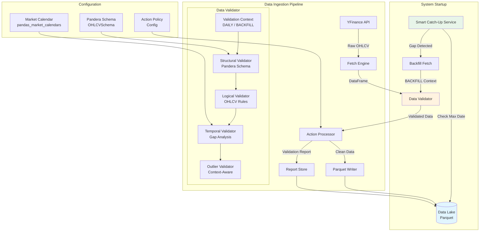
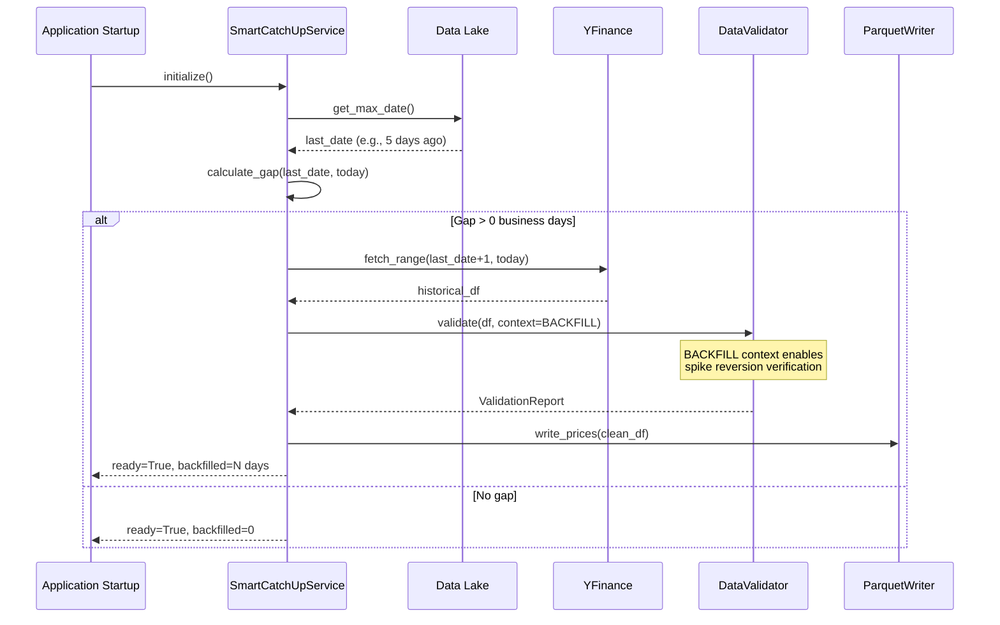
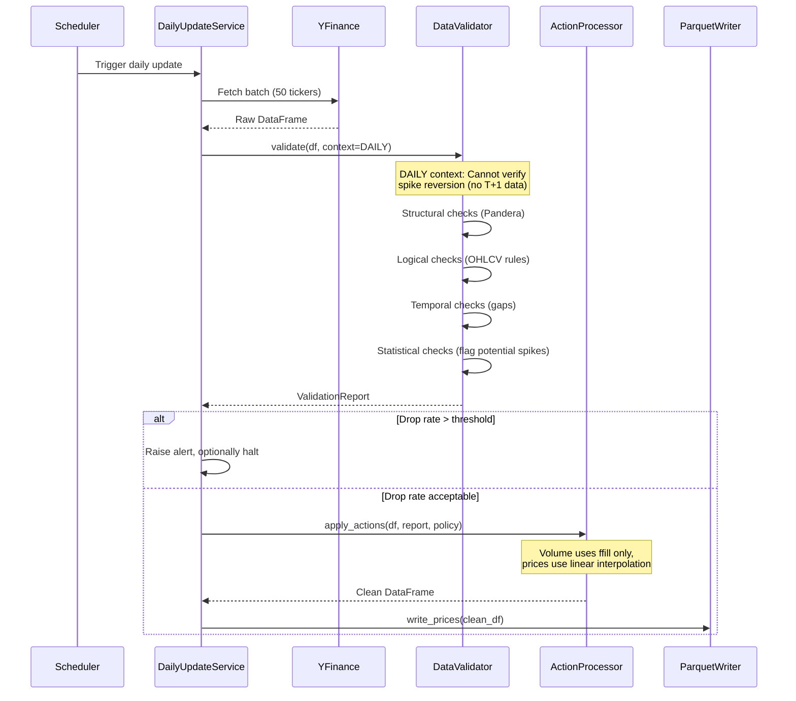

# Design Document: Data Integrity & Validation Framework

## Overview

The Data Integrity & Validation Framework provides a robust validation layer for market data ingested from yfinance. It addresses common data quality issues including missing data, price spikes, logical errors, and adjustment anomalies. The framework integrates with the existing Data Layer and Daily Update Workflow, using Pandera for declarative schema validation.

Key design considerations:
- **Context-aware validation**: Distinguishes between DAILY (real-time) and BACKFILL (historical) modes to handle the "time travel paradox" in spike detection
- **Strict volume handling**: Volume must be strictly positive (>0) for active tickers, with forward-fill interpolation only
- **Smart catch-up**: Automatic gap detection and backfill on system startup

## Architecture

The validation framework sits between the yfinance data fetch and Parquet storage, acting as a quality gate in the ingestion pipeline.



### Smart Catch-Up Flow



### Daily Update with Validation Context



## Components and Interfaces

### 1. ValidationContext Enum

```python
from enum import Enum

class ValidationContext(Enum):
    """
    Context for validation operations.
    
    DAILY: Real-time validation during daily updates.
           - Cannot verify spike reversion (no T+1 data)
           - Flags "potential spikes" for review
           
    BACKFILL: Historical validation during catch-up or backfill.
              - Can verify spike reversion using T+1 data
              - Confirms "spike" vs "persistent move"
    """
    DAILY = "daily"
    BACKFILL = "backfill"
```

### 2. OHLCVSchema (Pandera Schema)

```python
import pandera as pa
from pandera.typing import Series

class OHLCVSchema(pa.DataFrameModel):
    """
    Pandera schema for OHLCV market data.
    
    Note: Volume is strictly positive (gt=0) for active tickers.
    Zero volume typically indicates missing/invalid data from yfinance.
    """
    
    ticker: Series[str] = pa.Field(nullable=False)
    date: Series[pa.DateTime] = pa.Field(nullable=False)
    open: Series[float] = pa.Field(gt=0, nullable=False)
    high: Series[float] = pa.Field(gt=0, nullable=False)
    low: Series[float] = pa.Field(gt=0, nullable=False)
    close: Series[float] = pa.Field(gt=0, nullable=False)
    adj_close: Series[float] = pa.Field(gt=0, nullable=False)
    volume: Series[int] = pa.Field(gt=0, nullable=False)  # Strictly positive
    
    class Config:
        strict = True
        coerce = True
    
    @pa.check("high")
    def high_gte_low(cls, high: Series[float]) -> Series[bool]:
        """High must be >= Low (checked via dataframe_check)."""
        return high >= 0  # Actual check in dataframe_check
    
    @pa.dataframe_check
    def ohlcv_relationships(cls, df: pd.DataFrame) -> Series[bool]:
        """Validate OHLCV logical relationships."""
        return (
            (df["high"] >= df["low"]) &
            (df["high"] >= df["open"]) &
            (df["high"] >= df["close"]) &
            (df["low"] <= df["open"]) &
            (df["low"] <= df["close"])
        )
```

### 3. DataValidator Interface

```python
from abc import ABC, abstractmethod
from typing import List, Optional
import pandas as pd

class DataValidator(ABC):
    """Abstract interface for data validation."""
    
    @abstractmethod
    def validate(
        self, 
        df: pd.DataFrame,
        context: ValidationContext = ValidationContext.DAILY,
        lazy: bool = True
    ) -> ValidationReport:
        """
        Validate DataFrame and return report.
        
        Args:
            df: Input DataFrame to validate
            context: DAILY (no T+1 data) or BACKFILL (has T+1 data)
            lazy: If True, collect all errors; if False, fail on first error
            
        Returns:
            ValidationReport with all validation results
        """
        pass
    
    @abstractmethod
    def validate_structural(self, df: pd.DataFrame) -> List[ValidationIssue]:
        """Check column presence and data types."""
        pass
    
    @abstractmethod
    def validate_logical(self, df: pd.DataFrame) -> List[ValidationIssue]:
        """Check OHLCV logical relationships."""
        pass
    
    @abstractmethod
    def validate_temporal(
        self, 
        df: pd.DataFrame, 
        ticker: str
    ) -> List[ValidationIssue]:
        """Check for missing business days."""
        pass
    
    @abstractmethod
    def validate_statistical(
        self, 
        df: pd.DataFrame,
        context: ValidationContext
    ) -> List[ValidationIssue]:
        """
        Detect outliers and spikes.
        
        Context-aware behavior:
        - DAILY: Flags "potential_spike" (cannot verify reversion)
        - BACKFILL: Verifies reversion to confirm "spike" vs "persistent_move"
        """
        pass
```

### 4. SmartCatchUpService

```python
from datetime import date, timedelta
from typing import Optional, Tuple
import pandas as pd

class SmartCatchUpService:
    """
    Handles automatic data gap detection and backfill on system startup.
    
    Use case: Development server not running 24/7, needs to catch up
    on missed trading days before becoming operational.
    """
    
    def __init__(
        self,
        data_provider: 'DataProvider',
        validator: DataValidator,
        parquet_writer: 'ParquetWriter',
        market_calendar: 'MarketCalendar'
    ):
        self.data_provider = data_provider
        self.validator = validator
        self.parquet_writer = parquet_writer
        self.calendar = market_calendar
    
    def check_and_backfill(self) -> Tuple[bool, int]:
        """
        Check for data gaps and backfill if needed.
        
        Returns:
            Tuple of (ready: bool, days_backfilled: int)
        """
        last_date = self._get_max_date()
        today = date.today()
        
        gap_days = self._calculate_business_day_gap(last_date, today)
        
        if gap_days > 0:
            self._perform_backfill(last_date, today)
            return True, gap_days
        
        return True, 0
    
    def _get_max_date(self) -> date:
        """Get the most recent date in the data lake."""
        pass
    
    def _calculate_business_day_gap(
        self, 
        start: date, 
        end: date
    ) -> int:
        """Calculate number of missing business days."""
        business_days = self.calendar.valid_days(start, end)
        return len(business_days) - 1  # Exclude start date
    
    def _perform_backfill(self, start: date, end: date) -> None:
        """
        Fetch and validate historical data for the gap period.
        
        Uses BACKFILL context for validation, enabling spike
        reversion verification.
        """
        tickers = self._get_universe()
        
        # Fetch historical data
        df = self.data_provider.fetch_range(
            tickers=tickers,
            start=start + timedelta(days=1),
            end=end
        )
        
        # Validate with BACKFILL context
        report = self.validator.validate(
            df, 
            context=ValidationContext.BACKFILL
        )
        
        # Apply actions and write
        clean_df = self._apply_actions(df, report)
        self.parquet_writer.write_prices(clean_df, mode='append')
```

### 5. ActionPolicy Configuration

```python
from dataclasses import dataclass, field
from enum import Enum
from typing import Dict

class Action(Enum):
    WARN = "warn"
    DROP = "drop"
    INTERPOLATE = "interpolate"
    FFILL = "ffill"  # Forward fill (for volume only)

class InterpolationMethod(Enum):
    """Interpolation methods by column type."""
    LINEAR = "linear"      # For price columns only
    FFILL = "ffill"        # For volume (forward fill)
    ZERO = "zero"          # Fill with zero

@dataclass
class ActionPolicy:
    """
    Configuration for handling validation failures.
    
    Note: Volume interpolation is restricted to FFILL or ZERO.
    Linear interpolation creates non-integer values (e.g., 100.5 shares).
    """
    
    structural_failure: Action = Action.DROP
    logical_failure: Action = Action.DROP
    temporal_gap_single: Action = Action.INTERPOLATE
    temporal_gap_multi: Action = Action.WARN
    outlier_spike: Action = Action.DROP
    outlier_potential_spike: Action = Action.WARN  # DAILY context only
    outlier_persistent: Action = Action.WARN
    zero_volume: Action = Action.DROP  # Zero volume = invalid data
    
    # Interpolation methods by column
    interpolation_methods: Dict[str, InterpolationMethod] = field(
        default_factory=lambda: {
            'open': InterpolationMethod.LINEAR,
            'high': InterpolationMethod.LINEAR,
            'low': InterpolationMethod.LINEAR,
            'close': InterpolationMethod.LINEAR,
            'adj_close': InterpolationMethod.LINEAR,
            'volume': InterpolationMethod.FFILL,  # Never linear!
        }
    )
    
    # Thresholds
    sigma_threshold: float = 5.0
    pct_threshold: float = 0.50  # 50%
    max_drop_rate: float = 0.10  # 10%

@dataclass
class ValidationReport:
    """Structured validation results."""
    
    timestamp: datetime
    context: ValidationContext
    ticker: Optional[str]
    rows_input: int
    rows_output: int
    
    # Issue counts by type
    structural_issues: List[ValidationIssue]
    logical_issues: List[ValidationIssue]
    temporal_issues: List[ValidationIssue]
    statistical_issues: List[ValidationIssue]
    
    # Actions taken
    rows_dropped: int
    rows_interpolated: int
    rows_ffilled: int  # Volume forward-fills
    rows_warned: int
    
    # Spike tracking (context-aware)
    potential_spikes: List[Dict]  # DAILY: unverified
    confirmed_spikes: List[Dict]  # BACKFILL: verified reversion
    persistent_moves: List[Dict]  # BACKFILL: no reversion
    
    @property
    def passed(self) -> bool:
        return len(self.structural_issues) == 0
    
    @property
    def drop_rate(self) -> float:
        return self.rows_dropped / self.rows_input if self.rows_input > 0 else 0.0
    
    def to_json(self) -> str:
        """Serialize to JSON."""
        return json.dumps(asdict(self), default=str)
    
    @classmethod
    def from_json(cls, json_str: str) -> 'ValidationReport':
        """Deserialize from JSON."""
        data = json.loads(json_str)
        data['timestamp'] = datetime.fromisoformat(data['timestamp'])
        data['context'] = ValidationContext(data['context'])
        data['structural_issues'] = [ValidationIssue(**i) for i in data['structural_issues']]
        data['logical_issues'] = [ValidationIssue(**i) for i in data['logical_issues']]
        data['temporal_issues'] = [ValidationIssue(**i) for i in data['temporal_issues']]
        data['statistical_issues'] = [ValidationIssue(**i) for i in data['statistical_issues']]
        return cls(**data)
    
    def to_text(self) -> str:
        """Human-readable format."""
        lines = [
            "=" * 60,
            f"VALIDATION REPORT - {self.context.value.upper()} MODE",
            "=" * 60,
            f"Timestamp: {self.timestamp}",
            f"Ticker: {self.ticker or 'Multiple'}",
            "",
            "SUMMARY",
            "-" * 40,
            f"Rows Input:        {self.rows_input}",
            f"Rows Output:       {self.rows_output}",
            f"Rows Dropped:      {self.rows_dropped} ({self.drop_rate:.1%})",
            f"Rows Interpolated: {self.rows_interpolated}",
            f"Rows FFilled:      {self.rows_ffilled}",
            f"Rows Warned:       {self.rows_warned}",
            "",
        ]
        
        if self.context == ValidationContext.DAILY and self.potential_spikes:
            lines.extend([
                "POTENTIAL SPIKES (Unverified - DAILY mode)",
                "-" * 40,
            ])
            for spike in self.potential_spikes:
                lines.append(f"  {spike['ticker']} @ {spike['date']}: {spike['return']:.1%}")
        
        if self.context == ValidationContext.BACKFILL:
            if self.confirmed_spikes:
                lines.extend([
                    "CONFIRMED SPIKES (Reverted)",
                    "-" * 40,
                ])
                for spike in self.confirmed_spikes:
                    lines.append(f"  {spike['ticker']} @ {spike['date']}: {spike['return']:.1%}")
            
            if self.persistent_moves:
                lines.extend([
                    "PERSISTENT MOVES (Did not revert)",
                    "-" * 40,
                ])
                for move in self.persistent_moves:
                    lines.append(f"  {move['ticker']} @ {move['date']}: {move['return']:.1%}")
        
        return "\n".join(lines)

@dataclass
class ValidationIssue:
    """Single validation issue."""
    
    issue_type: str  # structural, logical, temporal, statistical
    severity: str    # error, warning
    row_index: Optional[int]
    column: Optional[str]
    message: str
    value: Optional[Any]
    action_taken: Action
```

### 6. ActionProcessor

```python
class ActionProcessor:
    """
    Applies configured actions to validation issues.
    
    Key constraint: Volume interpolation uses FFILL only, never linear.
    Linear interpolation creates non-integer values (e.g., 100.5 shares).
    """
    
    def __init__(self, policy: ActionPolicy):
        self.policy = policy
    
    def apply_actions(
        self, 
        df: pd.DataFrame, 
        report: ValidationReport
    ) -> pd.DataFrame:
        """
        Apply configured actions and return clean DataFrame.
        
        Processing order:
        1. Drop rows marked for DROP
        2. Interpolate/FFill rows marked for INTERPOLATE
        3. Log warnings for WARN rows
        """
        result = df.copy()
        
        # Collect row indices by action
        drop_indices = set()
        interpolate_indices = {}  # {row_idx: [columns]}
        
        for issue in report.all_issues:
            if issue.action_taken == Action.DROP:
                drop_indices.add(issue.row_index)
            elif issue.action_taken == Action.INTERPOLATE:
                if issue.row_index not in interpolate_indices:
                    interpolate_indices[issue.row_index] = []
                interpolate_indices[issue.row_index].append(issue.column)
        
        # Apply interpolation first (before dropping)
        for row_idx, columns in interpolate_indices.items():
            result = self._interpolate_row(result, row_idx, columns)
        
        # Drop invalid rows
        result = result.drop(index=list(drop_indices))
        
        return result.reset_index(drop=True)
    
    def _interpolate_row(
        self, 
        df: pd.DataFrame, 
        row_idx: int, 
        columns: List[str]
    ) -> pd.DataFrame:
        """
        Interpolate values using column-appropriate method.
        
        - Price columns: Linear interpolation
        - Volume: Forward fill (FFILL) only
        """
        result = df.copy()
        
        for col in columns:
            method = self.policy.interpolation_methods.get(
                col, 
                InterpolationMethod.LINEAR
            )
            
            if method == InterpolationMethod.LINEAR:
                # Linear interpolation for prices
                result[col] = result[col].interpolate(method='linear')
            elif method == InterpolationMethod.FFILL:
                # Forward fill for volume
                result[col] = result[col].ffill()
            elif method == InterpolationMethod.ZERO:
                # Fill with zero
                result.loc[row_idx, col] = 0
        
        return result
    
    def _can_interpolate(
        self, 
        df: pd.DataFrame, 
        row_idx: int
    ) -> bool:
        """Check if interpolation is possible (not first/last row)."""
        return 0 < row_idx < len(df) - 1
```

## Data Models

### ValidationIssue Schema

| Field | Type | Description |
|-------|------|-------------|
| issue_type | str | Category: structural, logical, temporal, statistical |
| severity | str | error or warning |
| row_index | Optional[int] | Affected row index (None for batch-level issues) |
| column | Optional[str] | Affected column name |
| message | str | Human-readable description |
| value | Optional[Any] | The problematic value |
| action_taken | Action | Action applied (WARN, DROP, INTERPOLATE, FFILL) |

### ValidationReport Schema

| Field | Type | Description |
|-------|------|-------------|
| timestamp | datetime | When validation ran |
| context | ValidationContext | DAILY or BACKFILL |
| ticker | Optional[str] | Ticker symbol (None for multi-ticker batches) |
| rows_input | int | Input row count |
| rows_output | int | Output row count after actions |
| structural_issues | List[ValidationIssue] | Column/type issues |
| logical_issues | List[ValidationIssue] | OHLCV rule violations |
| temporal_issues | List[ValidationIssue] | Missing day gaps |
| statistical_issues | List[ValidationIssue] | Outliers and spikes |
| rows_dropped | int | Rows removed |
| rows_interpolated | int | Rows with interpolated price values |
| rows_ffilled | int | Rows with forward-filled volume |
| rows_warned | int | Rows with warnings only |
| potential_spikes | List[Dict] | DAILY: Unverified spike candidates |
| confirmed_spikes | List[Dict] | BACKFILL: Verified spikes (reverted) |
| persistent_moves | List[Dict] | BACKFILL: Large moves that didn't revert |

### Spike Classification (Context-Aware)

| Context | Outlier Type | Classification | Action |
|---------|--------------|----------------|--------|
| DAILY | >5σ return | potential_spike | WARN (cannot verify) |
| BACKFILL | >5σ, reverts T+1 | confirmed_spike | DROP |
| BACKFILL | >5σ, persists | persistent_move | WARN |

## Correctness Properties

*A property is a characteristic or behavior that should hold true across all valid executions of a system-essentially, a formal statement about what the system should do. Properties serve as the bridge between human-readable specifications and machine-verifiable correctness guarantees.*

### Property 1: Required columns validation
*For any* DataFrame passed to the validator, if any required column (ticker, date, open, high, low, close, adj_close, volume) is missing, the validation SHALL fail with a structural error listing the missing columns.
**Validates: Requirements 1.1, 1.2**

### Property 2: OHLCV logical invariants
*For any* OHLCV record that passes logical validation, the following invariants SHALL hold: High >= Low, High >= Open, High >= Close, Low <= Open, Low <= Close, and all prices > 0.
**Validates: Requirements 2.1, 2.2, 2.3, 2.5**

### Property 3: Volume strict positivity
*For any* OHLCV record that passes validation, Volume SHALL be strictly positive (> 0). Zero volume indicates invalid/missing data.
**Validates: Requirements 2.4**

### Property 4: Action policy enforcement
*For any* validation issue and configured Action_Policy, the action taken SHALL match the policy: WARN passes data unchanged, DROP removes the row, INTERPOLATE replaces price values with linear interpolation, FFILL replaces volume with forward-fill.
**Validates: Requirements 5.2, 5.3, 5.4**

### Property 5: Volume interpolation restriction
*For any* volume value requiring interpolation, the system SHALL use forward-fill (FFILL) or zero-fill only. Linear interpolation SHALL NOT be applied to volume columns.
**Validates: Requirements 5.4 (volume-specific)**

### Property 6: Interpolation fallback
*For any* row marked for interpolation where interpolation is not possible (first row, last row, or no adjacent valid values), the system SHALL fall back to DROP action.
**Validates: Requirements 5.5**

### Property 7: Gap detection accuracy
*For any* time series with known missing business days, the temporal validator SHALL identify all gaps correctly, excluding market holidays.
**Validates: Requirements 3.1, 3.5**

### Property 8: Context-aware spike detection (DAILY)
*For any* outlier detected in DAILY context, the system SHALL classify it as "potential_spike" and apply WARN action, since T+1 data is unavailable for reversion verification.
**Validates: Requirements 4.3, 4.4**

### Property 9: Context-aware spike detection (BACKFILL)
*For any* outlier detected in BACKFILL context, the system SHALL verify reversion using T+1 data: if price reverts within 1 day, classify as "confirmed_spike" (DROP); otherwise classify as "persistent_move" (WARN).
**Validates: Requirements 4.3, 4.4**

### Property 10: Validation report round-trip
*For any* ValidationReport, serializing to JSON and parsing back SHALL produce an equivalent report with all fields intact, including context and spike classifications.
**Validates: Requirements 8.2, 8.4**

### Property 11: Lazy vs eager validation modes
*For any* DataFrame with multiple validation errors, lazy mode SHALL collect all errors while eager mode SHALL stop at the first error.
**Validates: Requirements 7.5**

### Property 12: Drop rate threshold alerting
*For any* validation run where the drop rate exceeds the configured threshold (default 10%), the system SHALL raise an alert.
**Validates: Requirements 6.3**

### Property 13: Ticker isolation on failure
*For any* batch of tickers where one ticker fails validation entirely, the remaining tickers SHALL still be processed successfully.
**Validates: Requirements 6.5**

### Property 14: Smart catch-up gap detection
*For any* system startup, the SmartCatchUpService SHALL correctly identify the gap between max(date) in data lake and today, excluding non-business days.
**Validates: Requirements 6.1 (startup integration)**

### Property 15: Smart catch-up uses BACKFILL context
*For any* backfill operation triggered by SmartCatchUpService, validation SHALL use BACKFILL context, enabling spike reversion verification.
**Validates: Requirements 4.3, 4.4 (backfill mode)**

## Error Handling

### Error Categories

| Category | Handling | Recovery |
|----------|----------|----------|
| Missing columns | Reject batch | Log error, skip batch |
| Type coercion failure | Reject row | Log error, continue |
| OHLCV logical error | Apply policy | Drop/Interpolate/Warn |
| Zero volume | Apply policy | Drop (default) |
| Missing business day | Apply policy | Interpolate/Warn |
| Potential spike (DAILY) | WARN | Log for review |
| Confirmed spike (BACKFILL) | DROP | Remove bad tick |
| Persistent move (BACKFILL) | WARN | Log, keep data |
| Pandera SchemaError | Convert to report | Continue validation |

### Exception Hierarchy

```python
class ValidationError(Exception):
    """Base validation exception."""
    pass

class StructuralValidationError(ValidationError):
    """Missing columns or type errors."""
    pass

class LogicalValidationError(ValidationError):
    """OHLCV rule violations."""
    pass

class TemporalValidationError(ValidationError):
    """Gap detection errors."""
    pass

class StatisticalValidationError(ValidationError):
    """Outlier detection errors."""
    pass

class CatchUpError(ValidationError):
    """Smart catch-up service errors."""
    pass
```
