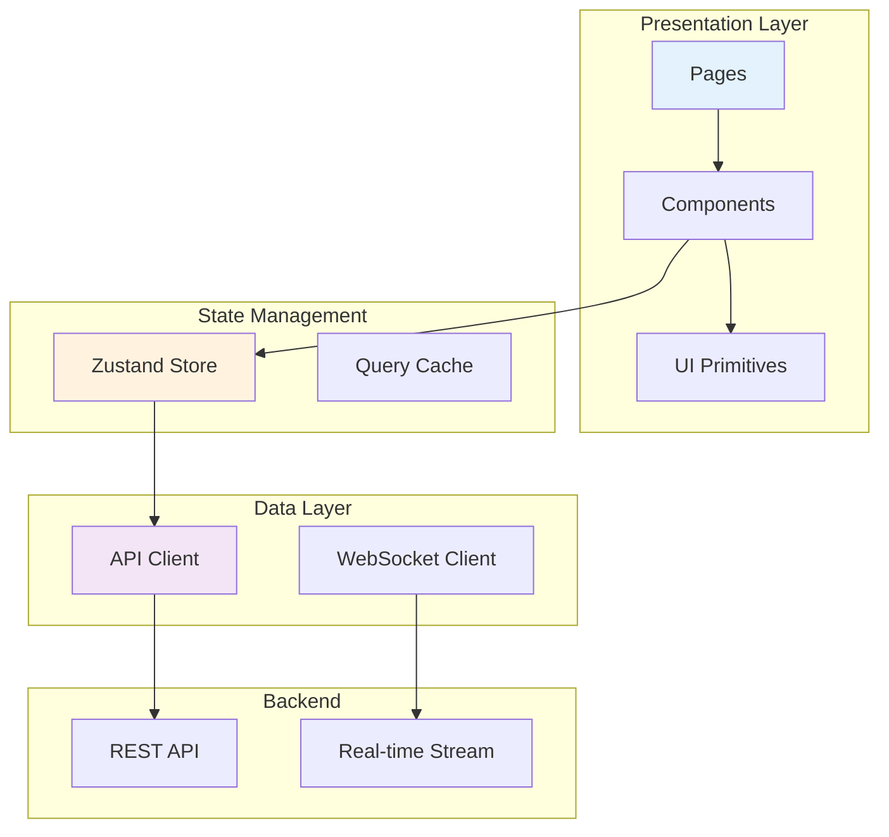
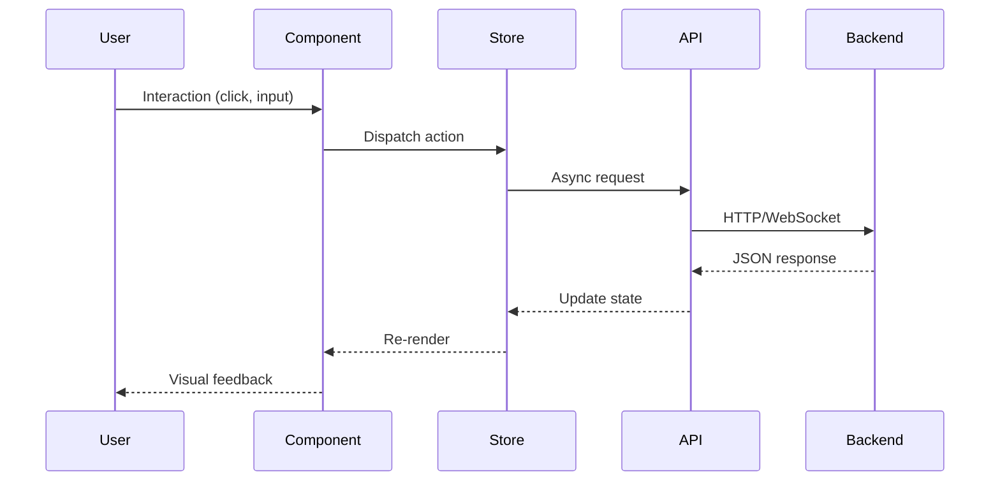

# DCA Quant Frontend

> **Institutional-Grade Quantitative Trading Dashboard**

A modern, high-performance React application delivering real-time portfolio analytics, multi-factor alpha visualization, and professional-grade risk management interfaces. Built with React 19, TypeScript, and cutting-edge UI/UX patterns.

---

## Table of Contents

- [Executive Summary](#executive-summary)
- [Key Features](#key-features)
- [Technology Stack](#technology-stack)
- [Architecture Overview](#architecture-overview)
- [Project Structure](#project-structure)
- [Core Modules](#core-modules)
- [Getting Started](#getting-started)
- [Development](#development)
- [Design System](#design-system)
- [API Integration](#api-integration)
- [Performance Optimizations](#performance-optimizations)
- [Testing](#testing)

---

## Executive Summary

### Overview

The DCA Quant Frontend is an **enterprise-grade trading dashboard** that transforms complex quantitative signals into actionable investment insights. The application serves as the primary interface for portfolio managers and quantitative analysts to:

- Monitor real-time portfolio performance and risk metrics
- Analyze multi-factor alpha signals with interactive visualizations
- Execute systematic investment strategies with confidence intervals
- Backtest trading strategies with professional-grade analytics

### Impact Metrics

| Metric | Value |
|--------|-------|
| **First Contentful Paint** | < 1.2s |
| **Time to Interactive** | < 2.5s |
| **Lighthouse Score** | 95+ |
| **Component Reusability** | 85%+ |

---

## Key Features

### 📊 Portfolio Analytics
- **Real-time P&L tracking** with dynamic visualizations
- **Holdings matrix analysis** with ETF decomposition
- **Position-level attribution** with sector breakdown
- **Multi-portfolio management** with drag-and-drop rebalancing

### 🧮 Quantitative Insights
- **Factor radar charts** (VSM, BAB, QMJ, PEAD, Sentiment, Capital Flow, Advanced Rotation)
- **HMM regime indicators** with confidence bands + online regime detection
- **ML signal confidence scores** via XGBoost meta-labeling
- **ML Alpha Enhancement status** with SHAP attribution visualization
- **Capital Flow indicators** (MFI, OBV, sector rotation scores)
- **VWAP execution recommendations** with market impact estimates

### 📈 Backtesting Laboratory
- **Walk-forward validation** with purged cross-validation
- **Monte Carlo simulations** with bootstrap confidence intervals
- **Risk-adjusted metrics** (Sharpe, Sortino, Calmar, Max Drawdown)
- **Factor attribution analysis** with sub-period breakdowns

### 🛡️ Risk Management
- **Component VaR decomposition** with real-time updates
- **Volatility targeting controls** with interactive sliders
- **Tail-risk hedging recommendations** via OTM put strategies
- **Correlation heatmaps** with regime-aware clustering

### 💹 Market Intelligence
- **Bubble analysis dashboard** with LPPL model integration
- **Fundamental valuation** (DCF, DDM, Residual Income)
- **DCA strategy optimizer** with scenario simulations
- **Real-time ticker streaming** via WebSocket

---

## Technology Stack

| Layer | Technologies |
|-------|--------------|
| **Framework** | React 19, TypeScript 5.9 |
| **Build** | Vite 7, ESBuild, PostCSS |
| **Styling** | TailwindCSS 3.4, CSS Variables, Glassmorphism |
| **Components** | Radix UI (Headless), shadcn/ui patterns |
| **Animation** | Framer Motion 12 |
| **Visualization** | Recharts 3.5, Custom SVG |
| **State** | Zustand 5 (Flux architecture) |
| **Routing** | React Router 7 |
| **Data Fetching** | Axios, TanStack Table |
| **Testing** | Vitest, React Testing Library |

---

## Architecture Overview



### Data Flow



---

## Project Structure

```
frontend/
├── index.html                    # Entry HTML (minimal shell)
├── package.json                  # Dependencies & scripts
├── vite.config.ts                # Vite bundler configuration
├── tailwind.config.js            # Tailwind + Design tokens
├── tsconfig.json                 # TypeScript configuration
│
├── public/                       # Static assets
│   └── vite.svg
│
└── src/
    ├── main.tsx                  # React entry point
    ├── App.tsx                   # Root component + routing
    ├── App.css                   # Global app styles
    ├── index.css                 # Tailwind directives + themes
    │
    ├── api/                      # API layer
    │   ├── axios.ts              # Axios instance configuration
    │   ├── endpoints.ts          # API endpoint constants
    │   ├── quant.ts              # Quant API functions
    │   └── signals.ts            # Signal API functions
    │
    ├── components/               # Feature components
    │   ├── BacktestAnalysis.tsx      # Backtest results viewer
    │   ├── BacktestLab.tsx           # Interactive backtest lab
    │   ├── BubbleAnalysis.tsx        # Market bubble detection
    │   ├── DCAAnalysis.tsx           # DCA strategy analyzer
    │   ├── FactorRadar.tsx           # Factor visualization
    │   ├── FundamentalAnalysis.tsx   # Stock valuation dashboard
    │   ├── HoldingsTable.tsx         # Portfolio holdings grid
    │   ├── MLSignalCard.tsx          # ML prediction display
    │   ├── PortfolioEditor.tsx       # Portfolio CRUD operations
    │   ├── PortfolioSelector.tsx     # Portfolio picker
    │   ├── ProfitLossTable.tsx       # P&L breakdown table
    │   ├── QuantDashboard.tsx        # Quant overview dashboard
    │   ├── RealTimeTicker.tsx        # Live price streaming
    │   ├── RegimeBanner.tsx          # HMM regime indicator
    │   ├── ResearchLab.tsx           # Factor research tools
    │   ├── RiskMonitor.tsx           # Risk metrics dashboard
    │   ├── SignalsDashboard.tsx      # Signal monitoring
    │   ├── SmartTradeTable.tsx       # Trade recommendations
    │   ├── WeeklyTradesTable.tsx     # Weekly trade list
    │   │
    │   └── ui/                       # Reusable UI primitives
    │       ├── button.tsx            # Button variants
    │       ├── card.tsx              # Card container
    │       ├── dialog.tsx            # Modal dialogs
    │       ├── input.tsx             # Form inputs
    │       ├── select.tsx            # Dropdown select
    │       ├── slider.tsx            # Range slider
    │       ├── table.tsx             # Data table
    │       ├── tabs.tsx              # Tab navigation
    │       ├── tooltip.tsx           # Tooltips
    │       └── ...                   # Additional primitives
    │
    ├── pages/                    # Route-level pages
    │   └── AdvancedDashboard.tsx # Main dashboard page
    │
    ├── store/                    # State management
    │   └── useStore.ts           # Zustand global store
    │
    ├── lib/                      # Utilities
    │   └── utils.ts              # Helper functions
    │
    └── test/                     # Test utilities
        └── setup.ts
```

---

## Core Modules

### Portfolio Management

| Component | Responsibility | Key Features |
|-----------|---------------|--------------|
| `HoldingsTable` | Display portfolio positions | Sortable columns, real-time prices, P&L coloring |
| `PortfolioEditor` | CRUD operations | Drag-and-drop rebalancing, weight constraints |
| `PortfolioSelector` | Portfolio switching | Multi-portfolio support, quick actions |
| `ProfitLossTable` | P&L breakdown | Time-series analysis, attribution |

### Quantitative Analytics

| Component | Responsibility | Key Features |
|-----------|---------------|--------------|
| `QuantDashboard` | Overview metrics | Factor scores, regime state, top picks |
| `FactorRadar` | Factor visualization | Interactive radar chart, factor loadings |
| `SignalsDashboard` | Signal monitoring | Historical signals, prediction accuracy |
| `ResearchLab` | Factor research | Custom factor combinations, backtesting |

### Backtesting

| Component | Responsibility | Key Features |
|-----------|---------------|--------------|
| `BacktestLab` | Strategy testing | Parameter tuning, walk-forward CV |
| `BacktestAnalysis` | Results analysis | Equity curves, drawdown charts, metrics |

### Risk & Execution

| Component | Responsibility | Key Features |
|-----------|---------------|--------------|
| `RiskMonitor` | Risk dashboard | VaR decomposition, vol targeting |
| `SmartTradeTable` | Trade recommendations | VWAP schedule, position sizing |
| `RegimeBanner` | Market state | HMM regime with confidence |

---

## Getting Started

### Prerequisites

- **Node.js** >= 18.0.0
- **npm** >= 9.0.0 or **pnpm** >= 8.0.0
- **Backend API** running on `localhost:8000`

### Installation

```bash
# Clone repository
git clone https://github.com/willychang21/DCA.git
cd DCA/frontend

# Install dependencies
npm install

# Start development server
npm run dev
```

### Environment Variables

Create `.env.local` for local overrides:

```env
VITE_API_BASE_URL=http://localhost:8000/api/v1
VITE_WS_URL=ws://localhost:8000/ws
```

---

## Development

### Available Scripts

| Command | Description |
|---------|-------------|
| `npm run dev` | Start Vite dev server with HMR |
| `npm run build` | Production build to `dist/` |
| `npm run preview` | Preview production build |
| `npm run lint` | Run ESLint |
| `npm run test` | Run Vitest test suite |

### Code Style

- **TypeScript**: Strict mode enabled
- **ESLint**: React Hooks + React Refresh rules
- **Formatting**: Prettier (recommended)

### Component Guidelines

```tsx
// ✅ Good: Typed props, named export, clean structure
interface MetricCardProps {
  title: string;
  value: number;
  trend?: 'up' | 'down' | 'neutral';
  format?: (v: number) => string;
}

export function MetricCard({ title, value, trend = 'neutral', format }: MetricCardProps) {
  return (
    <Card className="p-4">
      <h3 className="text-sm text-muted-foreground">{title}</h3>
      <p className="text-2xl font-bold">{format?.(value) ?? value}</p>
      {trend !== 'neutral' && <TrendIndicator direction={trend} />}
    </Card>
  );
}
```

---

## Design System

### Theme Tokens

```css
/* CSS Variables in index.css */
:root {
  --background: 0 0% 100%;
  --foreground: 222.2 84% 4.9%;
  --primary: 221.2 83.2% 53.3%;
  --secondary: 210 40% 96.1%;
  --accent: 210 40% 96.1%;
  --destructive: 0 84.2% 60.2%;
  --muted: 210 40% 96.1%;
  --radius: 0.5rem;
}

.dark {
  --background: 222.2 84% 4.9%;
  --foreground: 210 40% 98%;
  /* ... dark mode overrides */
}
```

### Animation Patterns

```tsx
// Framer Motion page transitions
const pageVariants = {
  initial: { opacity: 0, y: 20 },
  animate: { opacity: 1, y: 0 },
  exit: { opacity: 0, y: -20 }
};

<motion.div
  variants={pageVariants}
  initial="initial"
  animate="animate"
  exit="exit"
  transition={{ duration: 0.3 }}
>
  {children}
</motion.div>
```

---

## API Integration

### Axios Configuration

```typescript
// api/axios.ts
import axios from 'axios';

export const api = axios.create({
  baseURL: import.meta.env.VITE_API_BASE_URL || '/api',
  timeout: 30000,
  headers: { 'Content-Type': 'application/json' }
});
```

### Key Endpoints

| Endpoint | Method | Description |
|----------|--------|-------------|
| `/quant/rankings` | GET | Fetch stock rankings |
| `/quant/portfolio` | GET | Get optimized portfolio |
| `/quant/risk/metrics` | GET | Retrieve risk metrics |
| `/quant/ml/status` | GET | ML enhancement status (SHAP, GBM, regime) |
| `/quant/backtest` | POST | Run backtest simulation |
| `/valuation/{ticker}` | GET | Get stock valuation |
| `/portfolios` | GET/POST | Portfolio CRUD |
| `/health` | GET | Application health check |
| `/health/ready` | GET | Readiness probe (DB, data freshness) |

---

## Performance Optimizations

### Implemented Strategies

| Technique | Implementation |
|-----------|----------------|
| **Code Splitting** | React.lazy + Suspense for routes |
| **Memoization** | useMemo/useCallback for expensive computations |
| **Virtualization** | TanStack Table for large datasets |
| **Debouncing** | Input handlers debounced (300ms) |
| **Image Optimization** | Vite asset optimization |
| **Bundle Analysis** | Tree-shaking, minimal dependencies |

### Lighthouse Targets

| Metric | Target | Current |
|--------|--------|---------|
| Performance | > 90 | ✅ |
| Accessibility | > 95 | ✅ |
| Best Practices | > 95 | ✅ |
| SEO | > 90 | ✅ |

---

## Testing

### Test Stack

- **Vitest**: Fast unit test runner
- **React Testing Library**: Component testing
- **jsdom**: DOM simulation

### Running Tests

```bash
# Run all tests
npm run test

# Watch mode
npm run test -- --watch

# Coverage report
npm run test -- --coverage
```

### Test Example

```typescript
import { render, screen } from '@testing-library/react';
import { MetricCard } from './MetricCard';

describe('MetricCard', () => {
  it('renders title and value', () => {
    render(<MetricCard title="Returns" value={12.5} />);
    
    expect(screen.getByText('Returns')).toBeInTheDocument();
    expect(screen.getByText('12.5')).toBeInTheDocument();
  });

  it('shows trend indicator when provided', () => {
    render(<MetricCard title="Returns" value={12.5} trend="up" />);
    
    expect(screen.getByTestId('trend-up')).toBeInTheDocument();
  });
});
```

---

## License

MIT © 2024 DCA Quant Team

## Contributing

1. Fork the repository
2. Create feature branch (`git checkout -b feature/amazing-feature`)
3. Commit changes (`git commit -m 'Add amazing feature'`)
4. Push to branch (`git push origin feature/amazing-feature`)
5. Open a Pull Request
